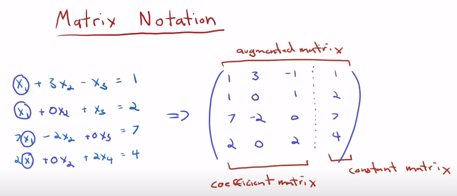
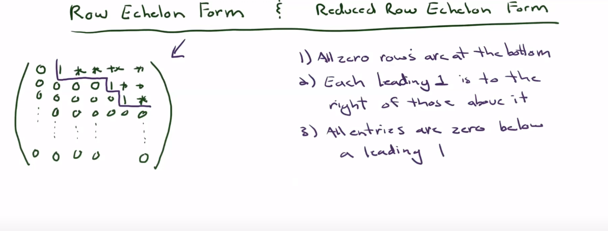

# Linear Algerba
Linear algebra is our 'good old algebra' that focuses on the study of vector spaces and linear mappings between those spaces. Algebraic representation of linear algebra problems are called linear equations. Geometrically, there will be no curves in a graphical representaion of a linear algebra problem. 

# 1. Matrix
A matrix is a two-dimensional array of numbers, symbols, or expressions, arranged in rows and columns. Matrix is vastly exploited by linear algebra to represent 
 - Systems of linear equations
 - Linear transformations
 - Eigenvalues and Eigenvectors, etc

### Inverse of a matrix
For a matrix A, if ```A@B == I == B@A``` then B is the inverse of A.
The matrix whose inverse exists is called Regular/ Non Singular/ Invertible matrix. 

### Transpose
Transpose of a matrix is obtained by interchanging its rows and columns.

## Operations
 - Matrix Addition
 - Matrix multiplication
 - Scalar multiplication
 - Scalar Multiplication

# 2. Vectors
A vector is a mathematical object used to represent quantities that have both magnitude and direction. 
There are (at least) three different ways to think about vectors: 
 - a vector as an array of numbers (a computer science view)
 - a vector as an arrow with a direction and magnitude (a physics view)
 - a vector as an object that obeys addition and scaling (a mathematical view).
Polynomials are also (unusual) instances of vectors, as they obey the mathematical view.

### Properties of vectors
 - Scalar multiplication (stretching)
 - Vector Addition

### Representation of vectors
 - In linear algebra, column vector form is often used when defining vectors, especially when working with matrix-vector multiplication because it aligns well with the matrix structure.
 - In physics, it's common to use row vector form for quantities like position vectors, which makes it easier to perform dot products with other vectors.
 - In computer programming, the choice may depend on the programming language and libraries being used.
 - **Generally, vectors can be represented as row or column depending on the context and ease of notation.** 

# 3. Vector Spaces
In mathematics, a vector space is an algebraic structure that consists of a set of vectors, along with two operations: vector addition and scalar multiplication.
It is a set, and every element in it is a vector.
**The concept of a vector space is foundational in linear algebra because it provides the mathematical framework and environment in which linear algebraic operations and transformations take place.**
The **Basis vectors** of a vector space refers to a set of linearly independent vectors that span the entire vector space.
``
## Span
The span of a set of vectors refers to the set of all possible vectors that can be obtained by the linear combination of the given vectors.

### Vector Subspace
They are sets contained in the original vector space with the property that when we perform vector space operations on elements within this subspace, we will never leave it.
Thus, vector subspaces are 'closed' under vector addition and scalar multiplication.

### Linear Independence
In linear algebra, a set of vectors is said to be "linearly independent" if none of the vectors in the set can be expressed as a linear combination of the others. 
Geometrically, linearly independent vectors in n-dimensional space do not lie in the same hyperplane. Intuitively, a set of linearly independent vectors consists of vectors that have no redundancy, i.e., if we remove any of those vectors from the set, we will lose something.
All column vectors are linearly independent if and only if all columns are pivot columns. If there is at least one non-pivot column, the columns (and, therefore, the corresponding vectors) are linearly dependent.

### Linear Combination of vectors
A linear combination of vectors is a mathematical operation that involves multiplying each vector by a scalar (a real number) and then adding the results together.

### Generating set
A set of vectors which spans the vector space. The minimal generating set is called basis.

### Basis
A set of linearly independent vectors that spans the vector space. Every vector space has a basis. The dimension of a vector space is the length of its basis. For eg, i,j,k are a basis of the cartesian coordinate system.
The dimension of a vector space is equal to the number of its basis vectors.

### Rank
`The number of dimensions of a vector after transformation.`
It is the number of dimensions in the column space.
The number of linearly independent columns of a matrix equals the number of linearly independent rows and is called the rank of A and is denoted by rk(). It is the number of non-zero rows in echlon form.
The rank of a matrix is a fundamental concept in linear algebra and is a measure of the "dimensionality" of the column space of the matrix. In simple terms, the rank is the maximum number of linearly independent columns (or rows) in a matrix.
It provides information about the "effective" dimension of the column space or row space. In other words, it quantifies how much "room" is occupied by the linearly independent vectors within the entire space.

# 4. Linear System of Equation (S.O.L.E)
### Solution to a S.O.L.E
Value of variable that satisfies multiple linear eqn is called the solution of the system of eqns. Geometrically, this solution will be on the intersection of the geometrical eqns(which can be lines, planes or hyperplanes).

### Representation of a S.O.L.E in Matrix form
Matrix can be used to reperesent a system of liner equations as:

In the image, the vectors are represented as rows in the matrix. You can also use columns as vectors - it is only a matter of convinience.

Now, a system of linear eqns can be represented by using matrix using **A@X = B**, where @ refers to matmul. This can be solved to obtain the soln of the S.O.L.E.
Here, the equation can have:
 - No soln : B is not in the *span* of A's.
 - One soln: The vectors are independent.
 - Inf soln: Some of the vectors are dependent.

### Row Echlon Form
Row echlon form of a matrix is a minimised version of the matrix that retains the same solutions as the base matrix (base set of vectors). Converting to this form can be helpful when doing matmul manully. There can be multiple row echlon form of a single matrix.


The matrix representation of a S.O.L.E can be changed to augmented matrix, and then represented in row echlon form. To do that, we can do three operations which will not change the solution set. They are called **elementary transformations**:
 - Multiply a row with a scalar
 - Add/sub a row with the multiple of another row
 - Interchange rows

If rank(A) == rank(augmented matrix) after converting both to row echlon form, then the system of linear eqns represented by the matrix is independent.
In row echlon form, the vectors are **generally** represented as rows in the coefficient matrix. Row operations are applied to the rows of the matrix to achieve the desired form, and the columns remain unchanged during this process.

# 5. Linear Mapping/ Linear Transformation
It's a mathematical function between two vector spaces that preserves vector addition and scalar multiplication. Geometrically, a linear mapping takes vectors from one space to another in a way that maintains the structure of those vectors.
`Matrix multiplication is a linear operation and can be represented as a linear transformation.`
i.e,
 - The grid lines must be parallel and evenly spaced.Therefore, all grid lines in the base vector space will remain lines (no curving). 
 - The origin remains at the exact place

The representation of a linear transformation can be done with a matrix which will represent the final coordinates of the basis vector.
Eg: A 2d linear transformation can be represented by a 2X2 matrix for the transformed vectors i and j, with each column representing a vector.

After writing transformation as vector form, we can obtain the transformation of a random vector (x,y) by matrix multiplying the transformation matrix A, with the new vector.i.e, `A@(x,y)`.


### Multiplication of two matices
Multiplying two transformation matrix results in the combination of both of those linear transformation.

### Kernel/ Null space
The kernel of a linear transformation, also known as the null space, is the set of all vectors that map to the zero vector under that transformation. In other words, it consists of the inputs that get "flattened" to zero when the transformation is applied.

### Image
In the context of linear algebra and linear transformations, the term "image" refers to the set of all possible output values that a linear transformation can produce.  


# 6. Eigenvalues and Eigen vectors

Whenever we do a linear transformation, some vectors just remain in the line in which it spans out. Such vectors are called eigen vectors. The amount by which these eigenvectors are stretched are called eigen values.


Use: For a 3d rotation, the eigen vector will be the axis of rotation.


We use this equation to compute the eigen value from eigen vectors.


What this means is that transforming the vector v using A will yield the same result as multiplying the vector with a scalar value λ.

And, only way two non zero matrices, becoming zero on matmul is if the det(A - λI) is zero. This would mean that the whole transformation squishes the space to a lower dimension.

Diagonal matrices have all basis as eigen vectors, with their eigen values being the diagonal values. This makes them super easy to work with.
