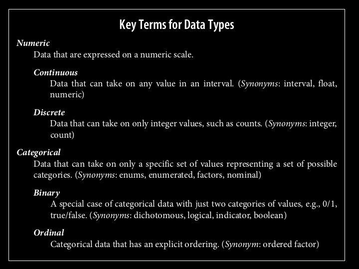
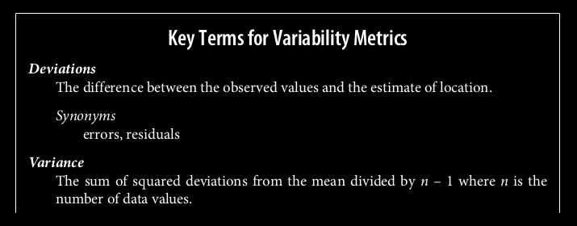
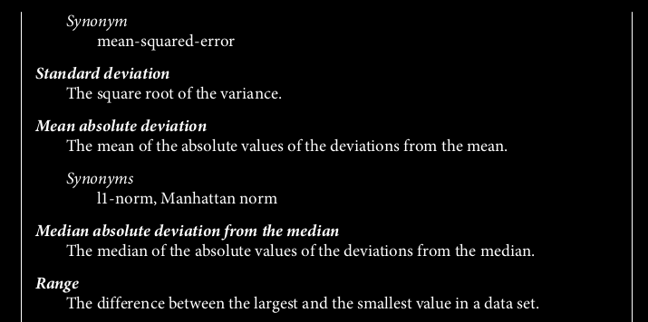
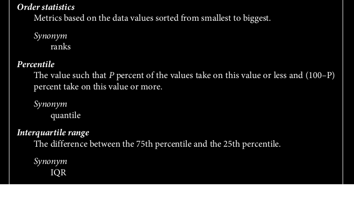

# Statistics

Statistics is a branch of mathematics that involves collecting, analyzing, interpreting, presenting, and organizing data. It provides methods for making inferences and decisions in the presence of uncertainty.

It provides the theoretical foundation and practical tools for understanding, analyzing, and improving the performance of machine learning models in various stages of the data science workflow.

- describe() method in pandas DataFrame can be used to create a statistical summary of the dataset.

### Types of statistical data

### Some important terms

# Types of Statistical Measures

## 1. Measure of frequenvy

Frequency indicate teh number of occurences of a data in a feature

## 2. Measures of Central Tendency

### Mean

The average of a feature. It is the sum of all values divided by the number of values. Affected by extreme values.
Good to be used on Gaussian distributions
Variations:

- Trimmed mean. To avoid influence of outliers.The trimmed mean can be thought of as a compromise between the median and the mean: it is robust to extreme values in the data, but uses more data to calculate the estimate for location.
- Weighted mean
  `df.col_name.mean()`

### Median

The median is the middle number on a sorted list of the data.
It is less dependent on the data, which can be bad. But this also means that median is less dependent on extreme values. Good to be used on non-gaussian distributions
Variations:

- weighted median
  `df.col_name.medan()`

### Mode

Most frequent value
`df.col_name.mode()`

## 3. Measures of spread

## 4. Measures of position
A different approach to estimating dispersion is based on looking at the spread of the
sorted data.

Location of a particular data point in the data set.
Percentile, quartile, std scores
