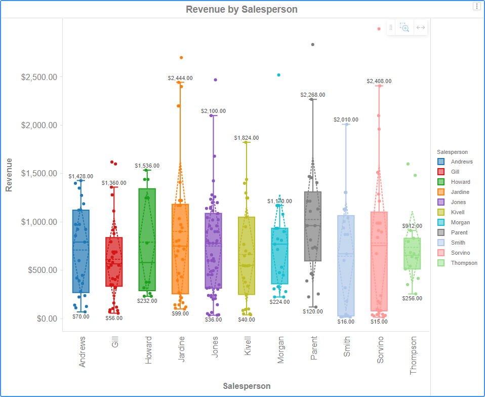

# Box Plot

A box plot, also known as a box-and-whisker plot, is a graphical representation of the distribution of a dataset. It provides a summary of key statistical measures and helps visualize the spread and central tendency of the data.

.png>)

Median (Q2): The line inside the box represents the median of the dataset, which is the middle value when the data is sorted.

Interquartile Range (IQR): The box itself spans the interquartile range, which is the range between the first quartile (Q1) and the third quartile (Q3). The IQR is a measure of statistical dispersion.

Whiskers: The "whiskers" extend from the box to the minimum and maximum values within a certain range. The range is often defined as 1.5 times the IQR. Any data points outside this range are considered outliers and are plotted individually.

Outliers: Individual data points that fall outside the whiskers are often plotted as points. Outliers can provide information about the variability and potential skewness in the data.

An example is:
