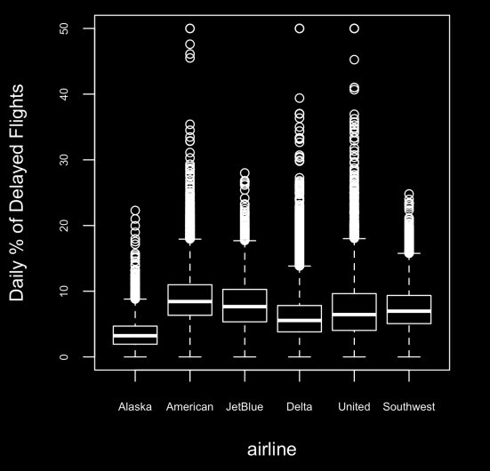
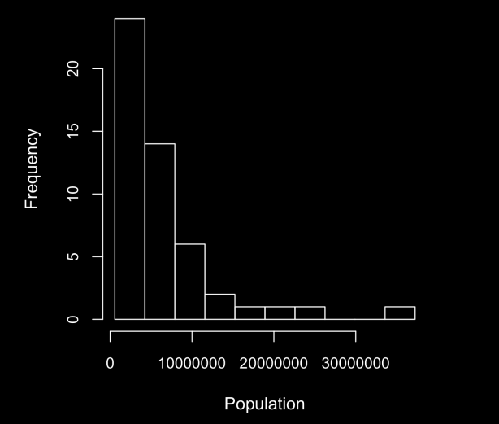
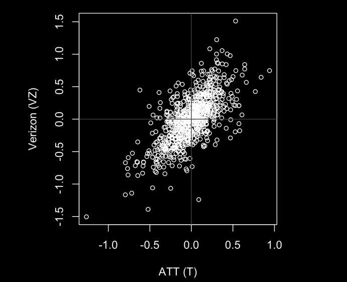

# Box Plot

A box plot, also known as a box-and-whisker plot, is a graphical representation of the distribution of a dataset. It provides a summary of key statistical measures and helps visualize the spread and central tendency of the data.

.png>)

Interquartile Range (IQR): The box itself spans the interquartile range, which is the range between the first quartile (Q1) and the third quartile (Q3). The IQR is a measure of statistical dispersion.

Whiskers: The "whiskers" extend from the box to the minimum and maximum values within a certain range. The range is often defined as 1.5 times the IQR. Any data points outside this range are considered outliers and are plotted individually.

Outliers: Individual data points that fall outside the whiskers are often plotted as points. Outliers can provide information about the variability and potential skewness in the data.

`df.boxplot(by='Category', column='Values', grid=False)`
An example is:


# Frequency Tables

They show frequency vs some other meaningful thing. There are many types of frequency tables:

```python
binnedPopulation = pd.cut(state['Population'], 10)
binnedPopulation.value_counts()
```

This code can be used to split a df into intervals.

### 1. Histogram

A histogram is a way to visualize a frequency table, with bins on the x-axis and the
data count on the y-axis. They generally used to plot interval vs frequency.



### 2. Bar charts
Used to show frequency for categorical values.

## Heatmaps
Corelation Matrix can be used to see the corellation between features. This can be better visualised using heatmaps.

```python
import seaborn as sns
sns.heatmap(df)
```

### Scatter plots

The standard way to visualize the relationship between two measured data variables is
with a scatterplot. The x-axis represents one variable and the y-axis another, and each
point on the graph is a record.



Hexagonal binning and contour plots are useful tools that permit graphical
examination of two numeric variables at a time, without being overwhelmed by
huge amounts of data.