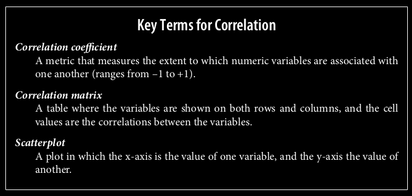

# Relationship Between Variables

## Correlation
It expresses the relationship between two variables as a number between -1 and 1.
`sns.heatmap(data.corr(),annot= True,linewidths=0.5,fmt = ".1f",ax=ax)`

- 1 means that the features are perfectly positively corelated.
- 0 means no relation
- -.3 means slight negative corelation

It's important to note that correlation does not imply causation. Even if two variables are correlated, it doesn't necessarily mean that one causes the other to change. Correlation only measures the strength and direction of a linear relationship between two variables.

High correlations between independent variables may indicate multicollinearity. This can affect the stability and reliability of regression models and may lead to overfitting. Consider whether highly correlated variables should both be included in your analysis, or if one could be dropped.

## Covariance

measure of the tendency of two variables to vary together
Covariance is zero if they are orthogonal.

