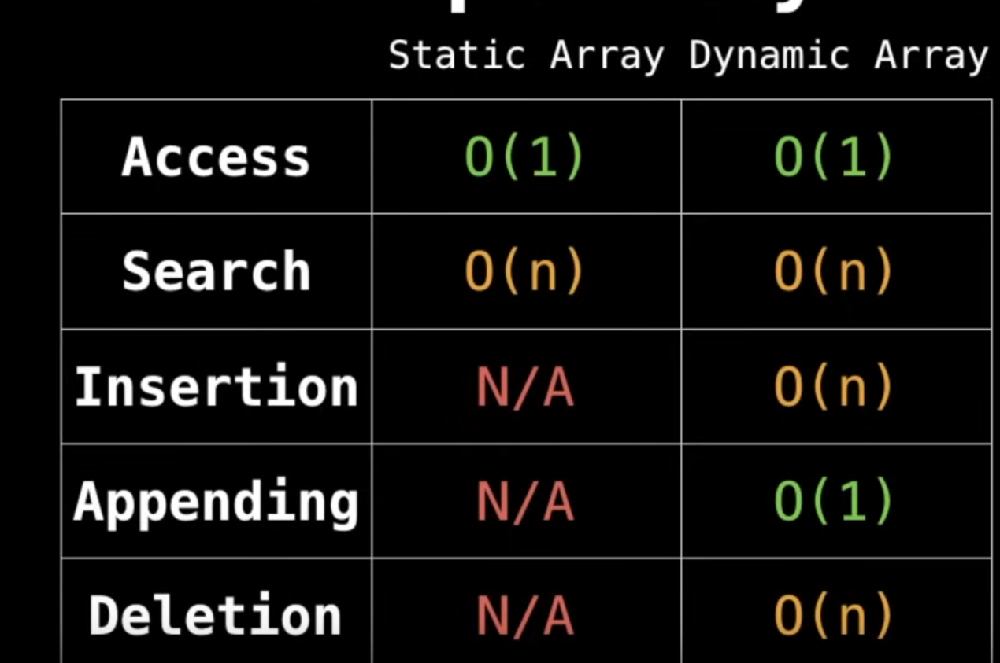

# Arrays - Lists
An array(static array) is a data structure that stores a collection of elements, where each element can be accessed using an indices. The elements in an array are typically of the `same data type`, and they are `stored in contiguous memory locations`.

Arrays are used to store and manipulate collections of data efficiently. They are widely used in programming for tasks such as storing lists of items, representing matrices, and implementing other data structures like queues and stacks. 

Python uses lists as array. It is:
- dynamic array (an array that can grow or shrink in size as needed)
- hetrogeneous
- Mutable
- allows nesting to create multidimensional array
- Supports Indexing
- Supports Slicing
- Supports Iteration [in cases like ‘for’ loop]

