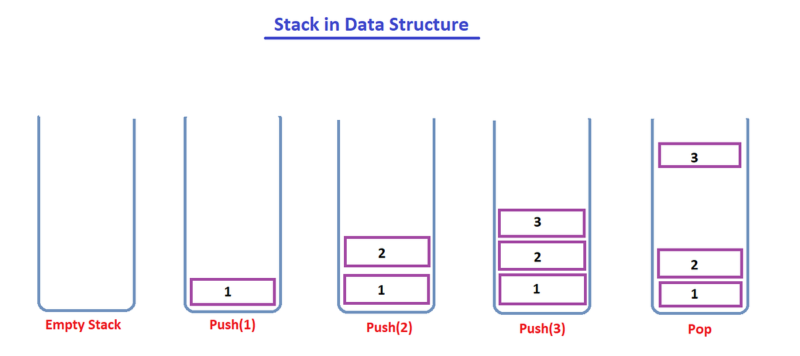
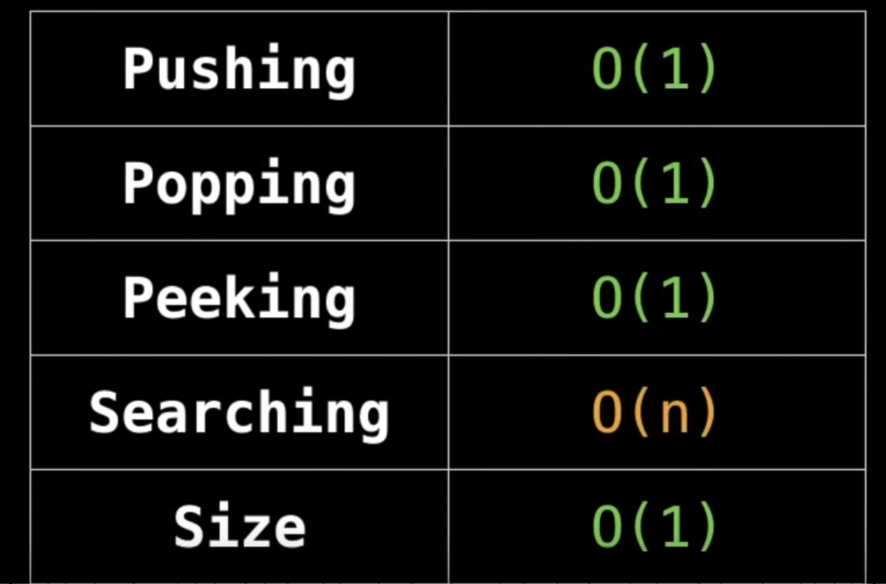
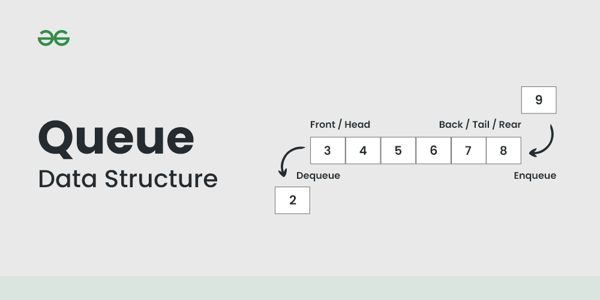
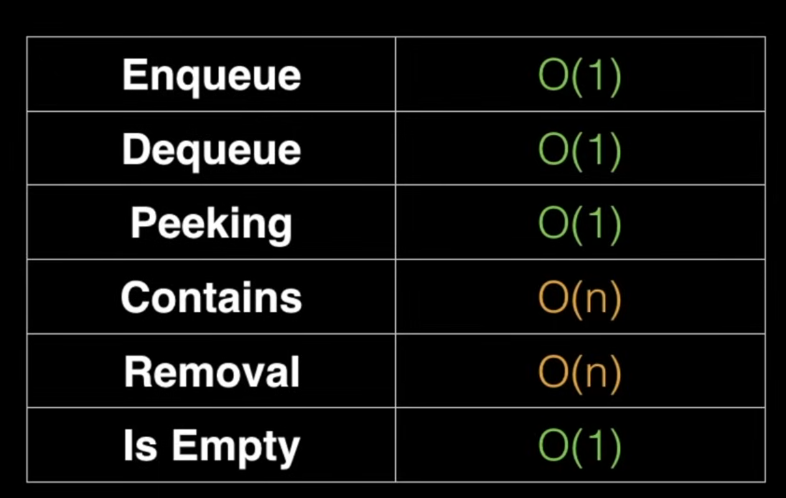
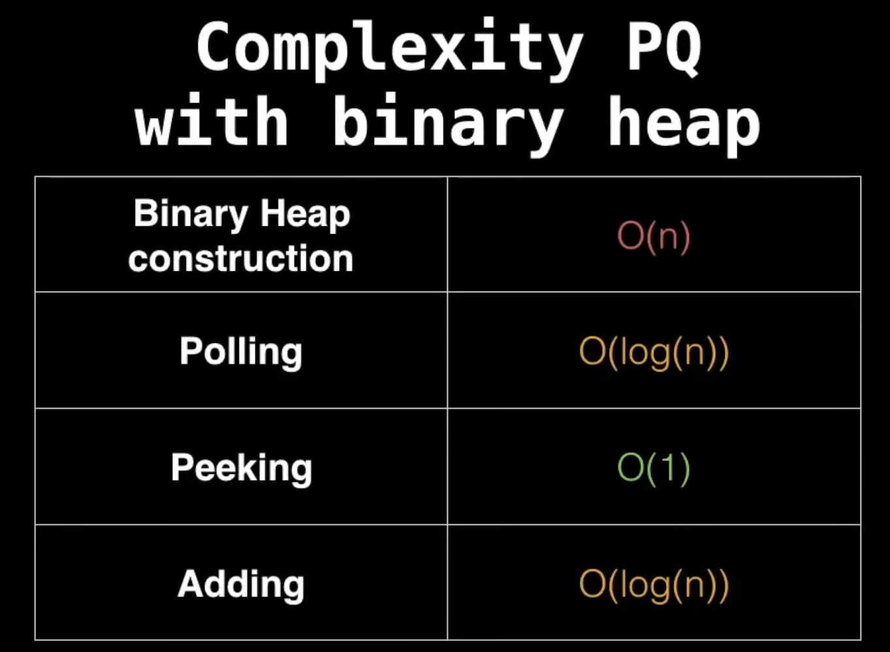
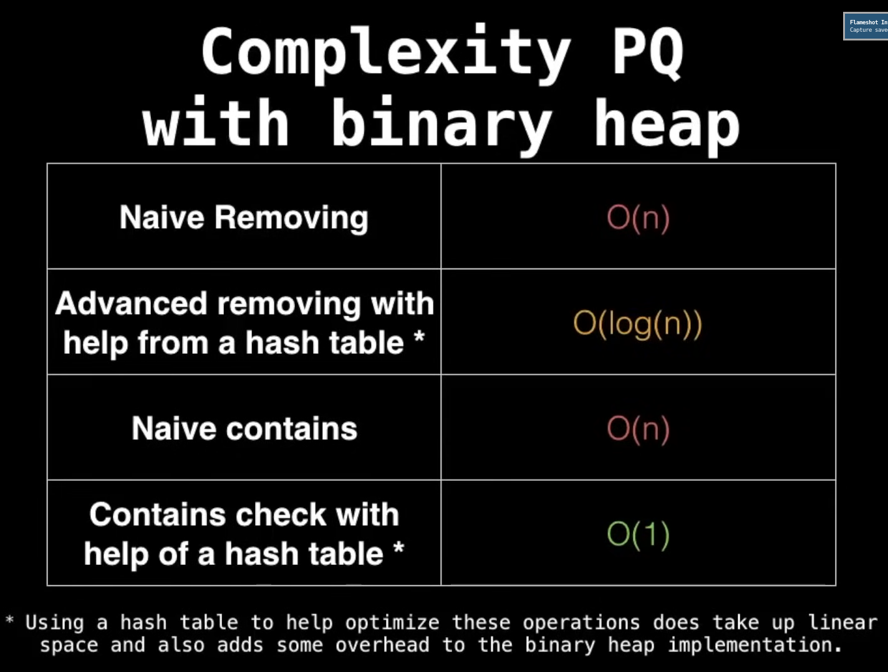

# Stack

Stack is a linear data structure that follows a particular order in which the operations are performed. The order is that the last inserted element is popped out first (LIFO).

- Top: The last inserted element in stack. It is imagined to exist at the topmost position of the stack.
- Seek: The process of displaying the top element
- Push: insert the element to the top of stack
- Pop: Remove element from top of stack

### Implementation in python
- We can use list as stack in python. We can use stack[-1] to seek the top element, append() to push and pop() to pop. But a problem with list is that it doesnot help us create static stack, with a specified number of elements. 
- We can use collections.deque to implement static stack.

# Queue
Queue is also a linear datastructure, but it follows LIFO principle. It has a front(removed) and a rear(inserted). 

- Enqueue: Insert at one end
- Dequeue: Pop from other end

#### Varients
- Circular Queue
- Double ended queue
- Priority Queue

## Priority Queue
A priority queue is an abstract data type similar to regular queue or stack data structure in which each element has a "priority" associated with it. In a priority queue, an element with higher priority is served before an element with lower priority.

They are generally implemented using heaps.

- A hack to turn all numbers from a min-priority queue into a max-priority queue is to negate all the numbers.