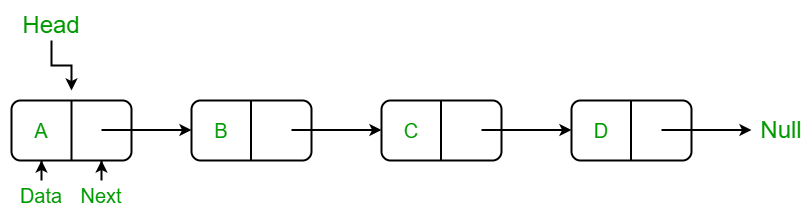
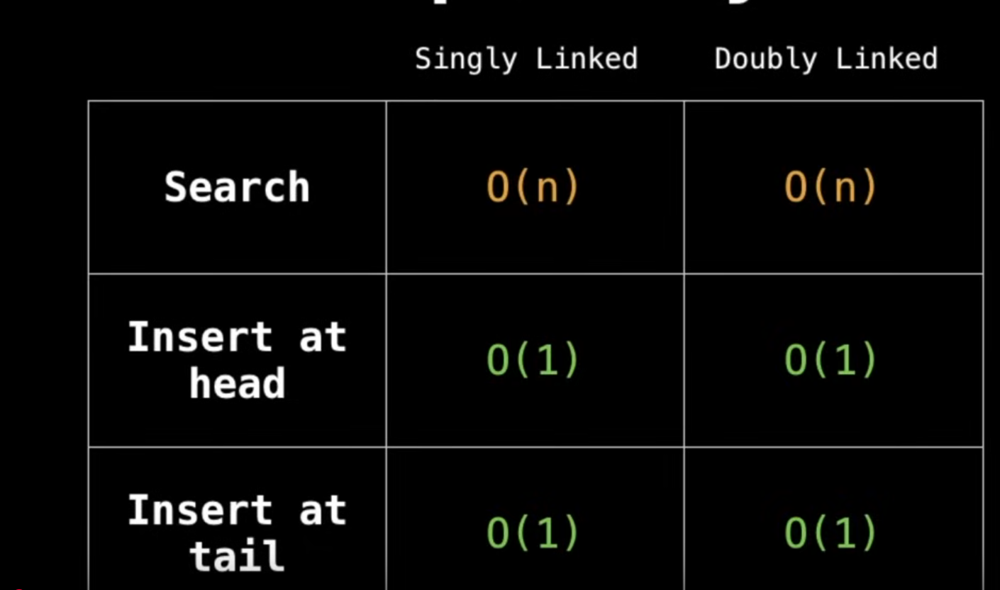

# Linked List
A linked list consists of a series of nodes, each containing two main components: the data/value that the node holds and a reference (or pointer) to the next node in the sequence. It doesn’t have a fixed length (nodes can be dynamically allocated).
The first node of the linked list is called the "head."

- Insertion is more efficient
- Has to store pointers -> more memory compared to arrays

## Complexity

#### Varients
- Doubly linked list: Links to next and previous elements.
- Circular Linked Lists: They do not have ends.

## Tips
- To find middle in O(n) time, use **fast-and-slow pointer technique**