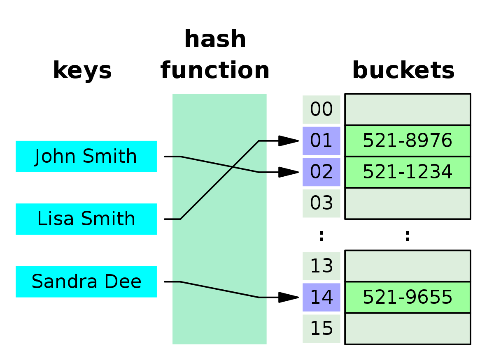
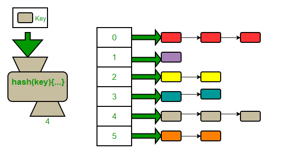
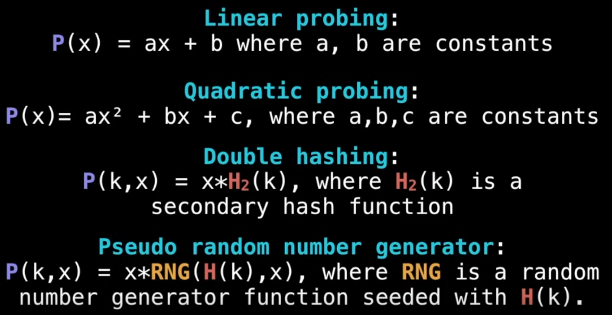
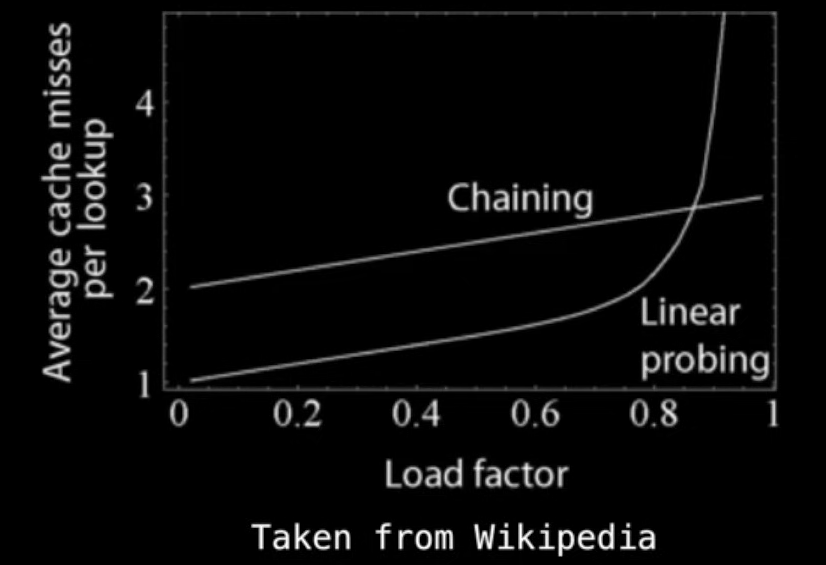

# Hash Maps
Hash maps/ Hash tables are used to store key-value pair. First we create an empty array. Then we define a hash function that converts the key to an index value. This index is used to store the corresponding value. 

**Python dictionaries** are implemented internally via hash maps. So they are very efficient.

A `hash value`, also known as a hash code or hash digest, is a fixed-size string of characters generated by a hash function from input data of any size. This hash value is used for very efficient lookup in hash maps.

## Hash functions
These hash functions take a 'immutable' key and return an integer index. A good hash function should be deterministic, minimize collisions and distribute keys uniformly across the array.

## Complexity
- Insertion/ Deletion: O(1)
- Lookup by key[search]: O(1)  # This is average case. Collisions can reduce this

`The reason why hashmaps are popular is because of the constant lookup time.`

# Hash Collisions
When multiple keys point to the same index, the situation is called collision. 
Some common ways to handle collision are:

1. **Chaining**: Creating an linked list at the collision part and chaining the (key,value) there.	

1. **Open Addressing**: Stores the value in the another available slot in the array. You have to also ensure that infinite loops of checking dont occur during this process. They are of different types:
   - **Linear Probing**: If a collision occurs, we check the next slot by a linear function P(x) = ax+b. A common choice is P(x) = x + 1, which checks the next slot sequentially.
   - **Quadratic Probing**: If a collision occurs, we check the next slot by a quadratic function P(x) = ax^2 + bx + c
   - **Double Hashing**: Uses a second hash function to determine the step size for probing. This secondary hash function is determined at runtime, and each collision leads to one multiple of the secondary hash function.

### Load Factor
The load factor is the ratio of the number of elements in the hash map to the size of the underlying array. It is a measure of how full the hash map is. A higher load factor can lead to more collisions and reduced performance. 
