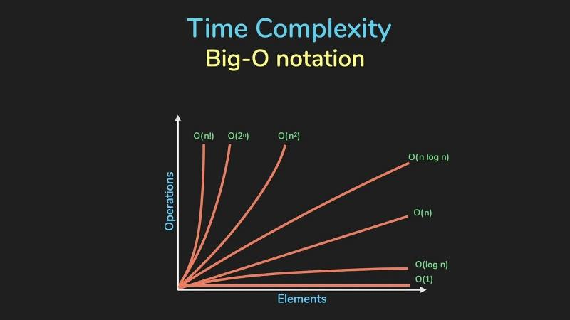

# Basics of Data Structures

### HOW TO APPROACH A DSA PROBLEM:
    (1) Understand problem. Note the input data and output data’s properties.
    (2) Figure out the data structure required
            1. Array
            2. Hash Map
            3. Stack
            4. Queue
            5. Linked List
            6. Tree
            7. Graph
            8. Heap/ Priority Queue
    (3) Find if any general technique is applicable
            1. Two pointer technique
            2. Sliding Window technique
            3. Recursion
            4. Backtracking
            5. Dynamic Programming
            6. Greedy
            7. Divide and conquer
    (4) Make algorithm, write it fully in shortest form. Check for side cases
    (5) Code it up


# 1. Data structure 
- refers to the structure in which we store data
- is of two types
    - Linear :  Array, Linked Lists, Stack, Queue
    - Non-Linear: Trees, Graphs

### Abstract Data Type (ADT)
An ADT is a high-level description of a data structure that defines a set of operations that can be performed on the data structure and the behavior of those operations. It focuses on what operations can be performed and what their expected behavior is, rather than how those operations are implemented.

# 2. Algorithms
An algorithm is the step-by-step instructions to solve a given problem. 

### Algorithmic Analysis
The quality of an algorithm is measured from its execution time and memory requirement. This can be represented in a polynomial form as shown in figure. This notation is called asymptotic notation. There are three ways to show the complexity of an algorithm:
- Big O: Worst case
- Big Ω: Best case
- Big ϴ: Mixture of the above two. It shows the average case performance.



Among these, the big O is the most important as it lets us know the upper bound or worst performance an algorithm can perform. 

#### Basic Things to know to calculate Complexity
- A loop that iterates 'n' times contributes a factor of 'n' to the complexity.
- Nested loops multiply the complexity by the number of nested levels.
- Such a loop gives a time complexity of O(log n)

```
while ct < 100:
    print(“Hello”)
     ct = ct * 2           # as this variable increases exponentially 
```
- Non looped statements do not contribute to time complexity. Eg: if-else, prints, inputs, etc.

Do many questions are there in Lion book. Its different everytime. Me skimmed through.
