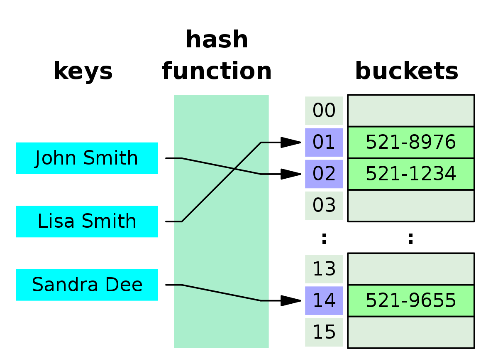
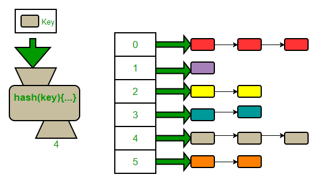

# Hash Maps
Hash maps/ Hash tables are used to store key-value pair. First we create an empty array. Then we define a hash function that converts the key to an index value. This index is used to store the corresponding value. 

**Python dictionaries** can be used implements hash maps. 

**Counter** in python(present in the collections library) is another data structure that implements hash maps. It counts the number of occurences of every element and stores them in a hash map.

A hash value, also known as a hash code or hash digest, is a fixed-size string of characters generated by a hash function from input data of any size.

## Complexity
- Insertion/ Deletion: O(1)
- Lookup by key[search]: O(1)  # This is average case. Collisions can reduce this

`The reason why hashmaps are popular is because of the outstanding constant lookup time.`

## Methods
- get(): used to return a default value(like 0) if the key is not present in a hashmap. 

# Collisions
When multiple keys point to the same index, the situation is called collision. 
Some common ways to handle collision are:

1. **Chaining**: Creating an linked list at the collision part and chaining the (key,value) there.	

2. **Linear Probing**: Stores the value in the next available slot in the array. We are ‘linearly probing’ the array for an empty slot.

