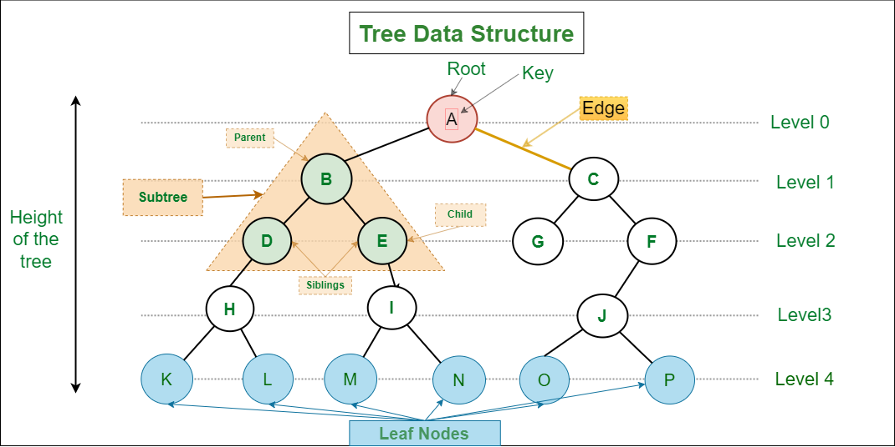
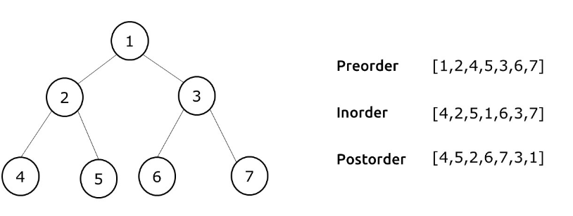

# Trees
A tree is a non-linear data structure where each node points to a number of nodes. They represent a heirarchical nature in graphical form.  It consists of nodes connected by edges.

# Types of trees
- Binary Tree: In a binary tree, each node has at most two children, which are referred to as the left child and the right child. Binary trees are widely used for various purposes, including binary search trees (BSTs) and expression trees.

- Binary Search Tree (BST): A binary search tree is a binary tree with the property that the value of each node's left child is less than or equal to the node's value, and the value of each node's right child is greater than or equal to the node's value. BSTs are often used for efficient searching and sorting, as inorder traversal through BST gives sorted, unique elements. 

- B-Tree: A B-tree is a self-balancing tree structure that is commonly used in databases and file systems. It is designed to handle large amounts of data efficiently by maintaining a balance between depth and number of keys per node.

- Red-Black Tree: A red-black tree is a type of self-balancing binary search tree in which each node has a color (red or black) and follows specific rules to maintain balance. Red-black trees are used in various applications, including data storage and lookup.

- Heap: A heap is a specialized tree-based data structure that satisfies the heap property. Heaps are often used for priority queues and heap-sort algorithms. There are two common types of heaps: max-heap (where the parent node is greater than or equal to its children) and min-heap (where the parent node is smaller than or equal to its children).

## Traversal in trees

### 1. DFS
Here we traverse to the deapths. It include pre-order, in-order and post-order method of traversal. They are generally implemeted using a stack. Also, while these DFS is commonly associated with binary trees, it is a general traversal technique that can be used for various tree and graph structures.
- Time complexity: O()
- Space complexity: O()

It has variants like:
- Iterative DFS
- Limited DFS

### 2. BFS
We first traverse completely in one level, before moving to the one below it. It is generally implemented using a queue. 
- Time complexity: O()
- Space complexity: O()