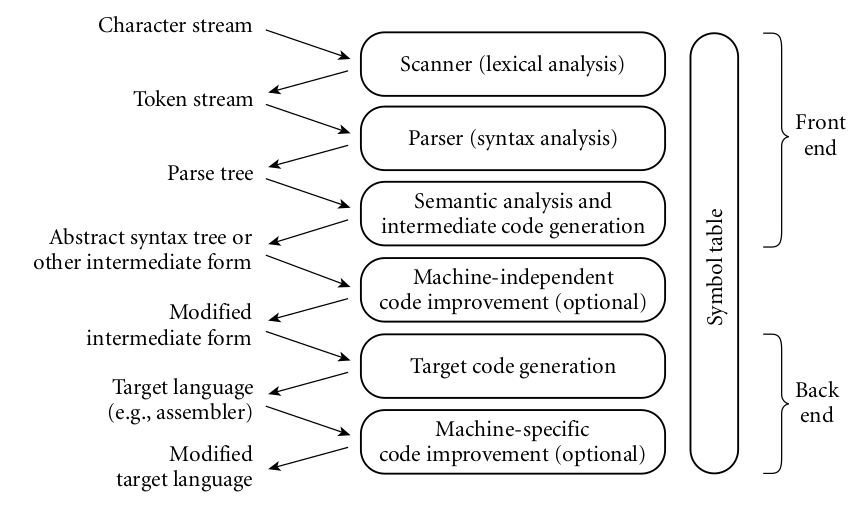

# Compilers
- The compiler translates the high-level source program into an equivalent target program (typically in machine language), and then goes away. At some arbitrary later time, the user tells the operating system to run the target program.
- faster than interpreters
- Since the (final version of a) program is compiled only once, but generally
executed many times, the savings can be substantial, particularly if the interpreter is doing unnecessary work in every iteration of a loop.
- A surprising number of compilers generate output in some high-level
language—commonly C or some simplified version of the input language.
Such source-to-source translation is particularly common in research languages
and during the early stages of language development
- In some cases a programming system may deliberately delay compilation until
the last possible moment. This is known as just-in-time compilation, and is used because it can lead to faster execution times.
- Front end: The part of the compiler that reads the source program and translates it into an intermediate form. It is machine independent.
- Back end: The part of the compiler that translates the intermediate form into the target program. It is machine dependent.

### Working of a compiler
1. Lexical analysis(or Scanning): The source program is read character by character and grouped into tokens.
2. Syntax analysis: The tokens are grouped into phrases based on the rules of the language. The tokens are arranged into a syntax tree (also called a parse tree) based on grammar rules of the language. To check if the structure of the code follows the rules of the language.
3. Semantic Analysis: The compiler checks the meaning of the code to ensure logical consistency and correctness. It is the discovery and representation of the meaning of the code.
4. Intermediate code generation: The compiler generates an intermediate code that is independent of the target machine.
5. Code Optimization: The intermediate code is optimized to improve the efficiency of the code. This is machine independent.
6. Target code generation: The compiler generates the target code for the specific machine.
7. Code optimization (again): The compiler optimizes the target code to improve the efficiency of the code. This is machine dependent.
8. Code linking: The compiler links the target code with the libraries and other necessary files to create the final executable program.
9. Error Handling: The compiler checks for errors in the code and provides error messages to the user.

# Interpreters
- In effect, the interpreter implements a virtual machine whose “machine language” is the high-level programming language. The interpreter reads statements in that language more or less one at a time, executing them as it goes along
- interpretation leads to greater flexibility and better diagnostics (er-
ror messages) than does compilation.
