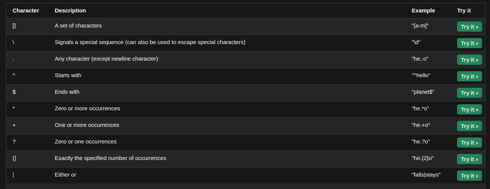
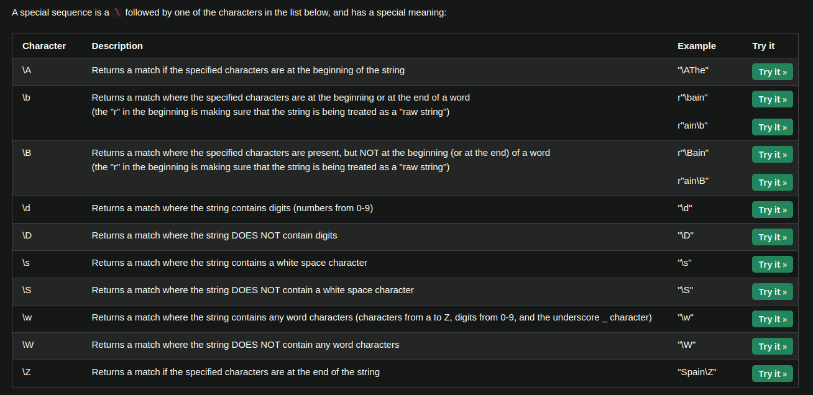

Credits to this amazing blog post: https://www.w3schools.com/python/python_regex.asp

# Regular Expression in Python

## Patterns

### Special Sequences

## Functions
- findall(pattern, txt): find all and return the finds
- search(pattern, txt): return first occurence's object
- split(pattern, txt): split() with the word's position
- sub(txt1, txt2): substitute

