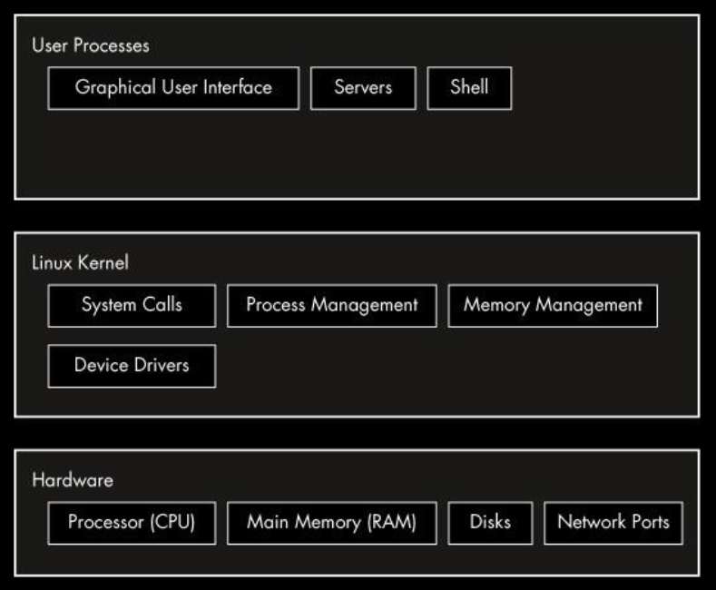

# Layers of Abstraction

- A Linux system has three main levels. The hardware layer is the lowest layer, consisting of the computer's hardware.
- The next level up is the kernel, which is the core of the operating system. The kernel is software residing in memory that tells the CPU what to do. The kernel manages the hardware and acts primarily as an interface between the hardware and any running program.
- The upper level is user space, which consists of process(which is managed by the kernel)

### Linux Kernel

The Linux kernel is the core component of the Linux operating system. It serves as the bridge between the hardware of a computer system and the higher-level software applications. It provides essential services to applications and ensures that different software components can communicate with the hardware in a standardized way.

### Kernel mode and User mode

There is a critical difference between the ways that the kernel and user processes run: The kernel runs in kernel mode, and the user processes run in user mode.
Code running in kernel mode has unrestricted access to the processor and main memory. This is a powerful but dangerous privilege that allows a kernel process to easily crash the entire system. The area that only the kernel can access is called kernel space.
User mode, in comparison, restricts access to a (usually quite small) subset of memory and safe CPU
operations. If a process makes a mistake and crashes, the consequences are limited and can be cleaned up by the kernel.
