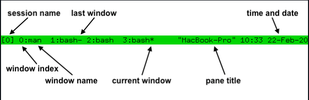

# TMUX - terminal multiplexer
tmux is a program which runs in a terminal and allows multiple other terminal programs to be run inside it. It allows multiple sessions with windows, panes, and more.

## Primary uses
- Protect running programs on a remote server from connection drops by running them inside tmux.
- Allow programs running on a remote server to be accessed from multiple different local computers.
- Work with multiple programs and shells together in one terminal, a bit like a window manager.

## TMUX concepts
- tmux keeps all its state in a single main process, called the tmux server.
- `Panes` are the individual sections within a window that can be split and used for different tasks.
- `Windows` are the separate environments within which these panes exist. A window is made up of one or more panes which together cover its entire area. They are tabs in sessions.
- `Sessions` allow you to group related windows together and provide a convenient way to manage and switch between them. 

## Tmux status line

# Tmux terminal commands

1. Create new tmux session
   1. tmux new -s < SessionName >: Creates a new session with the SessionName
2. tmux ls: Lists all sessions
3. Attach
   1. tmux a: Attach to the most recent tmux session
   2. tmux a -t < SessionName >: Attach to the index (get index from tmux ls)
4. Kill a session: tmux kill-session -t < SessionName >
5. Kill the whole server: tmux kill-server

# Shortcuts
`[ Leader ]: C-b`

### General
1.  [ Leader ] ?: List keys
2.  [ Leader ] d: Detach from a session
3.  [ Leader ] ?

### Panes
1.  [ Leader ] %: Split pane vertically
2.  [ Leader ] ": Split pane horizontally
3.  [ Leader ] < arrows >: Move around tmux panes
4.  [ Leader ] q < Index >: Move around tmux panes fast 
5.  [ Leader ] C-< arrows >: Adjust size of panes
6.  [ Leader ] Alt-< arrows >: Adjust size of panes fast
7.  [ Leader ] Alt-< 1 to 5>: Choose pre-selected layouts for panes
8.  [ Leader ] X: To kill a pane
9.  [ Leader ] ;: Last pane 

### Window
10. [ Leader ] c: Create a new window
11. [ Leader ] n: Move to next window
11. [ Leader ] l: Move to last window
12. [ Leader ] ,: Rename the current window
13. [ Leader ] &: Kill the window(and all the panes in it)
14. [ Leader ] w: Move through windows
15. [ Leader ] p: Last window
16. [ Leader ] q: Synchronise windows

### Copy mode
17. [ Leader ] [: Start copy mode
18. [ Leader ] space: Start copying
19. [ Leader ] < arrow/ hjkl > Move around
20. [ Leader ] Enter: Stop copying
21. [ Leader ] C-v: Paste

https://github.com/tmux/tmux/wiki/Getting-Started