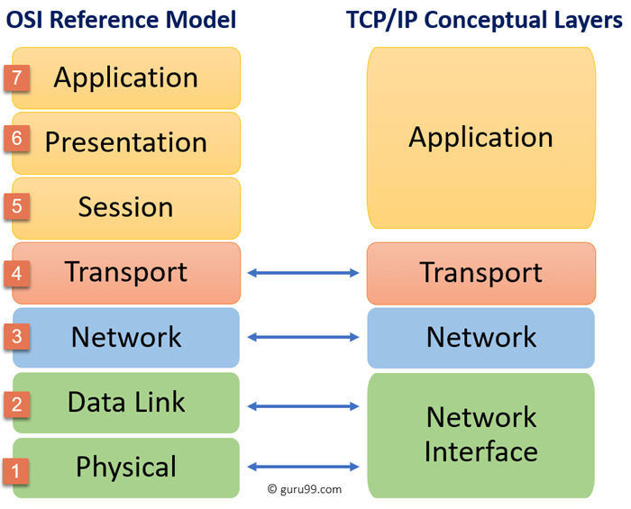

# Layering
Layering in computer networks involves organizing communication protocols into a series of abstraction layers. Each layer has a specific function and interacts with the layers above and below it. The layers are designed to be modular, allowing for easier development, maintenance, and interoperability of network protocols.

# Protocols
Set of rules that governs data communication.

# Layer Architectures
1. OSI Reference model
2. TCP/IP model

# OSI Reference model

- Open System Interconnection
- Not a protocol :0
- Just a guideline for a flexible, robust network architecture. Hence called reference model
- Intended to show a way to faciliate communication without changing the underlying logic in hardware. 
- Never fully implemented. It is used for education and testing though.
- Very modular, and easy to troubleshoot
- 7 Layers of OSI model: All People Should Try New Dominos Pizza.

- The communication between two hosts, using the osi model is shown

- The intermediate nodes will conly have access to the phy, data link and network layer information.

7. Application Layer:
 - Provides an interface between application and user
 - It generates the data. This is where the user gives in the to-network data
6. Presentation Layer:
 - Encrypt, Compress, Translation of data
5. Session Layer:
 - Establishes, maintains and synchronises interation btw communicating devices 
4. Transport Layer:
 - Responsible for delivery of msg
 - Port adressing (Port Adress)
 - Segmentaion and reassembly
 - Connectio and flow control
 - Error control
3. Network Layer:
- Also responisble for msg delivery
 - Logical addressing (IP)
 - Routing
2. Data Link Layer:
 - Responsible for moving data(frames) from one layer to another
 - Framing
 - Physical adressing (MAC)
 - Flow, Access and error control
1. Physical Layer:
 - Responsible for transmitting bits over medium
 - Data rate, Representation and sync of bits
 - Physical topology

# TCP/IP model

- Transmission Control Protocol/ Internet Protocol
- This model is used for networking all over the world, and OSI model is used just as reference
- 4 layers in the TCP/IP model: Network Access Layer, Network/ Internet layer, Transport layer and Application layer.

- Sometimes, it is split into 5 layers by splitting Network access layer into phy and data link layer 
- The layers work just like the OSI model, but the application layer in TCP/IP model does the work of Application, Presentation and Session layers.

## PDU
 