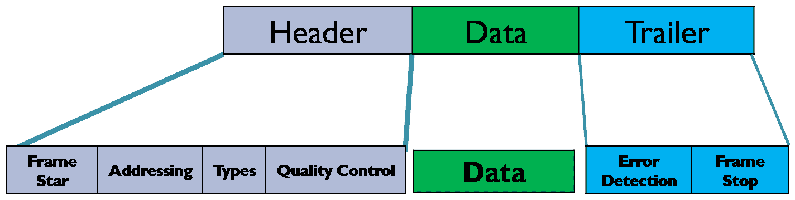

# Data Link Layer
Uses physical layer to send bits over communication channel
To accomplish these goals, the data link layer takes the packets it gets from the network layer and encapsulates them into frames for transmission.
- It uses MAC address

It has three parts:

The functions of data link layer are:
1. framing: dividing the stream of bits received from the Network Layer into manageable data frames.
2. addressing
3. error detection and correction: by calculating and comparing checksum, and sending acknowledgement
4. flow control:feedback based or rate based. These can be implemented as stop-and-wait flow control and sliding window based

