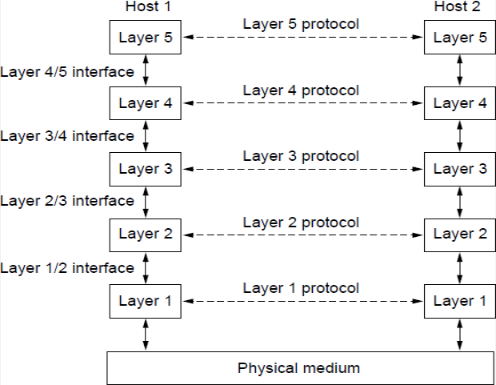
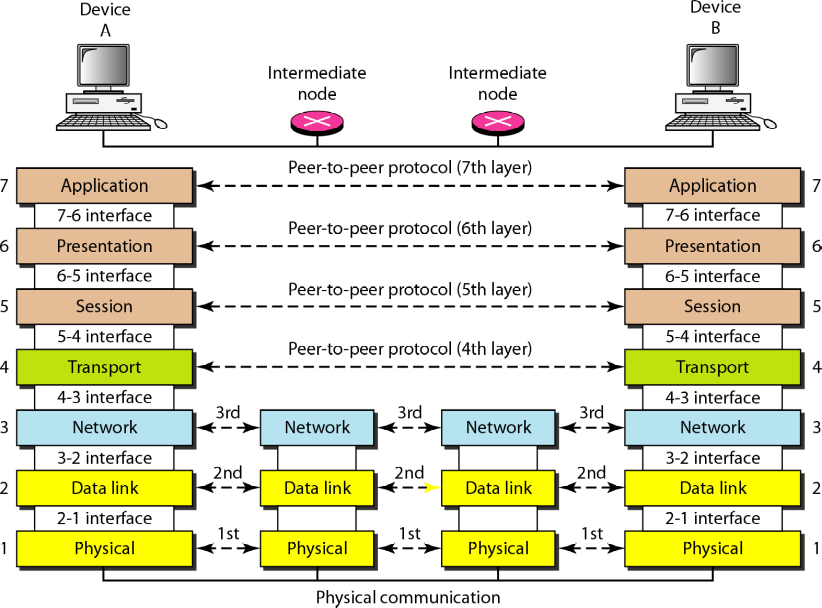
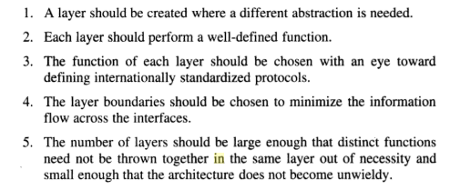
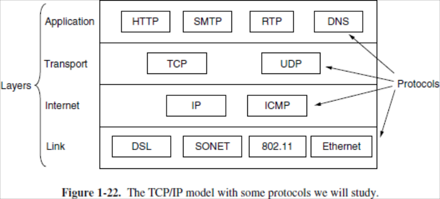
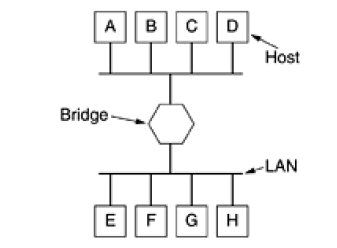
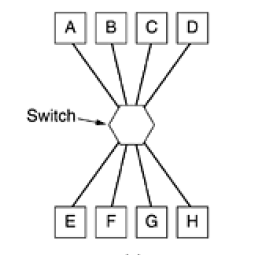
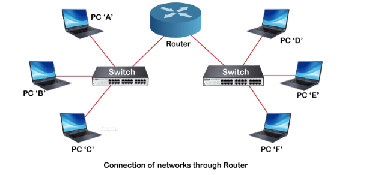

# Computer Network
A network can be defined as a group of computers and other devices connected in some way so as to be able to exchange data.Each of the devices on the network can be thought of as a node, each node has a unique address.

# 1. TYPES OF COMPUTER NETWORK
1. PAN - Personal Area Network
   - one person in a building
   - Eg: Wireless keyboard, printers, etc.
2. LAN - Local Area Network
   - Privately owned network in a building
   - To share resources and exchange information
   - Also called enterprise networks
   - Wired LAN - Ethernet
   - Wireless LAN - WiFi
3. MAN - Metropolitian Area Network
   - Spans an entire geographical area (like a city)
   - Eg: Cable TV
4. WAN - Wide Area Network
   - Even larger geographical area (like a country or a continent)
5. Internetworks
   - A collection of interconnected networks is called an internetwork or internet.

### Some Terms
1. VPN: Extends private network across public network to provide improved security and anonymity.
2. Internet Service Provider(ISP): Organisation that provide services for using the internet. 

# 2. NETWORK SOFTWARE
Network software plays a crucial role in enabling communication and data exchange between devices and systems in a computer network. It involves various components and concepts that help manage, control, and optimize network operations. Here are some key aspects of network software:
 - Protocol hierarchies
 - Interface & Service
 - Service Primitives
 - Design issues for the layers

### Network protocols 
Network protocols are a set of rules and conventions that define how data is transmitted and received over a computer network.

To reduce their design complexity, most networks are organized as a stack of layers or levels, each one built upon the one below it. The number of layers, the name of each layer, the contents of each layer, and the function of each layer differ from network to network. The purpose of each layer is to offer certain services to the higher layers, shielding those layers from the details of how the offered services are actually implemented. 
Each layer passes data and control information to the layer immediately below it, until the lowest layer is reached. Actual communication occurs when the information passes layer-1 and reaches the Physical medium.

A set of layers and protocols is	called a **network architecture**. A list of the protocols used by a certain system, one protocol per layer, is called a **protocol stack**.

### Interface & Service

**Interface**: An interface in network software defines how different layers or components communicate with each other. It specifies the rules and protocols for interaction between entities in adjacent layers. 

**Service:** In network communication, a service defines the interface between two layers, where the lower layer acts as the service provider, and the upper layer acts as the service user. The service specifies what operations the lower layer is ready to perform on behalf of its users but doesn't detail how these operations are implemented. Services abstract the functionality offered by one layer to the layer above it.

### Service Primitives
Service primitives are a set of high-level communication operations or functions provided by a network service to its users. These primitives serve as a standardized way for users to request and interact with network services. Common service primitives include: 
It includes Listen, Accept, Connect, Disconnect, Send, Recieve.

### Network reference models
Network reference models are conceptual frameworks used to standardize and describe the functions and interactions of various networking components and protocols within a computer network.
The most important of them are:

1.**OSI Reference Model**: 
In its most basic form, it divides network architecture into  seven layers which, from top to bottom, are the Application,  Presentation, Session, Transport, Network, Data-Link, and  Physical Layers.

**Principles applied to create the seven layers are**

The OSI (Open Systems Interconnection) model is a framework for networking systems, consisting of seven layers, each with specific functions:

 - Physical Layer: Manages physical hardware, like cables and switches. It transfers bits. This is where communication takes place. 
 - Data Link Layer: Deals with local network communication, including error detection and framing. Changes bits/packets to frames.
 - Network Layer: Focuses on routing data between different networks using logical addresses (e.g., IP).
 - Transport Layer: Ensures end-to-end communication, with either reliable (TCP) or unreliable (UDP) options. Transports packets.
 - Session Layer: Establishes and manages communication sessions.
 - Presentation Layer: Handles data format translation and encryption.
 -  Application Layer: Interfaces with user applications, providing services like web browsing and email.
  
The OSI model helps standardize networking concepts and communication protocols across different devices and systems.

2.**TCP/IP Reference Model**

The TCP/IP reference model, also known as the Internet protocol suite, is a conceptual framework that standardizes the functions and protocols used for communication on the Internet and most modern computer networks. It serves as a blueprint for how data should be transmitted, routed, and received across a network.In contrast to the OSI model, which has seven layers, the TCP/IP model condenses the functions of the OSI model into four layers, making it a more practical framework for understanding how the Internet and modern networks operate. 
The TCP/IP model consists of four distinct layers, each with its own set of protocols and responsibilities:

**Application Layer:**
 - The top layer in the TCP/IP model.
 - Responsible for high-level application - services and user interfaces.
 - Eg: https
 - This layer deals with - application-specific data and - interacts directly with end-user - applications.

**Transport Layer:**
- Located just below the application - layer.
- Responsible for end-to-end - communication, data segmentation, and - ensuring the reliability of data - delivery.
- Includes two primary transport - protocols: TCP (Transmission Control - Protocol) and UDP (User Datagram - Protocol).
- TCP provides reliable, connection-oriented communication with error detection and correction, while UDP offers a connectionless, lightweight, and low-latency transport option.

**Internet Layer:**
- Sits below the transport layer.
- The job of Internet Layer is to permit hosts to inject  packets into  any network and have them travel  independently to the destination (potentially on a  different network).
- Handles addressing, routing, and forwarding of data packets across different networks.
- The central protocol at this layer is IP (Internet Protocol), which assigns unique IP - addresses to devices and routes packets between networks based on these addresses.
  
**Link Layer (or Network Access Layer):**
- The lowest layer in the TCP/IP model.
- Deals with the physical and data link aspects of network communication.
- Responsible for addressing devices on the local network (e.g., MAC addresses in Ethernet) - and managing the actual transmission of data over the physical medium.

# 3. CONNECTING DEVICES

### 1. Bridge
 - Their primary function is to connect and filter traffic between different segments or segments of a network to optimize network performance and reduce traffic congestion.
 - Used to connect multiple LANs (working on the same protocol) together to form a larger LAN. Thus it can expand size of the network.
 - Bridges operate at the data link layer of the OSI model and hence also referred as Layer 2 switches.
 - As a physical layer device, it regenerates the signal it receives.
 - Routing bridges, Transparent bridges, Local bridges, Remote bridges

### 2. Switch
 - A switch is a fundamental networking device that operates at the data link layer (Layer 2) of the OSI model. 
 - Switches are more advanced, capable, and efficient devices that have largely replaced bridges in modern network environments. 
 - Switches are essential for efficiently and intelligently forwarding data packets between devices in a network. 
 - Used to join multiple computers together with  in one local area network (LAN).
 - Devices connected to switch will be on same subnet.
 - Packet collision is minimum as it directly communicates between source and destination.

### 3. Router
 - Routers are networking devices operating at layer 3 or a network layer of the OSI model. 
 - It connects different networks together and sends data packets from one network to another.
 - It transfers data in the form of IP packets. 
 - In order to transmit data, it uses IP address mentioned in the estination field of the IP packet.
 - Routers have a routing table in it that is refreshed periodically according to the changes in the network. 
 - Main functions  of router are  forwarding and routing of packets
  

### 4. Gateways
 - Connects two networks with different  communication protocols, data format or different architectures. 
 - The gateway acts as a “Translator”  or protocol converter  in between two different systems.
 - Depending on its functionality it operates in all the layers of the model
 - A Gateway is the most intelligent device among the network connecting devices. Intelligent in terms of its working, error control, data packet routing, transmission speed, etc. 

### 5.Brouter
 - It is also known as the bridging router is a device that combines features of both bridge and router.
 - It can work either at the data link layer or a network layer.  

### 6. NIC - Network Interface Card
 - NIC is a network adapter that is used to connect the computer to the network.
 - It is installed in the computer to establish a LAN. 
 - It has a unique id(MAC address) that is written on the chip, and it has a connector to connect the cable to it. 
 - NIC card is a layer 2 device which means that it works on both the physical and data link layers of the network model. 