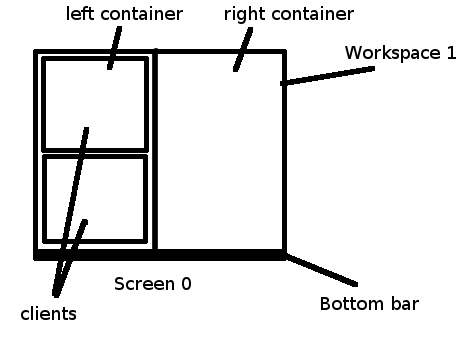

# i3 window Manager
i3 is a window managing software. It supports tiling, stacking, and tabbing layouts, which are handled manually. 

# Shortcuts

` Mod = Start` (Alt is another popular alternative)

## Basic Bindings
- Mod Return 	        open terminal
- Mod Shift Space       toggle floating window mode
- Mod Shift c           Reload the configuration file
- Mod Shift r           Read i3 inplace

## Modifying Container
- Mod Shift q           Kill a workspace
- Mod < arrow >         Move to different containers in the current workspace
- Mod Shift < arrow >   Switch the current window to the arrow window's location
- 
- Mod < 0-9 >           Switch to another workspace
- Mod Shift < 0-9 >     Move the current container into a different window

## Modifying current workspace
- Mod f                 Change mode to: fullscreen
- Mod v                 Change mode to: split a workspace vertically
- Mod h                 Change mode to: split a workspace horizontally
- Mod r                 Change mode to: resize mode
- Mod e                 Change mode to: default
- Mod s                 Change mode to: stacking
- Mod w                 Change mode to: tabbed

## Dealing with other appilication
- Mod d                 Open a default application

# Custom Shortcut
- Alt tab               Toggle between last two windows
- Mod Tab               Loop between tabs present in current workspace