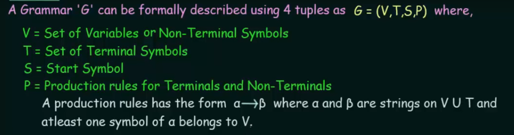
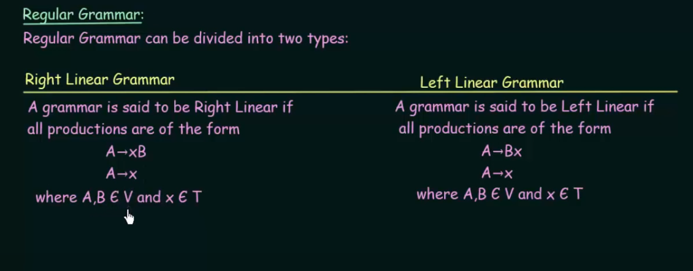
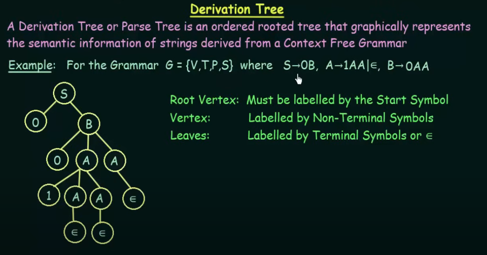
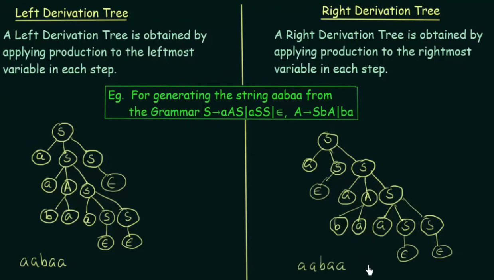
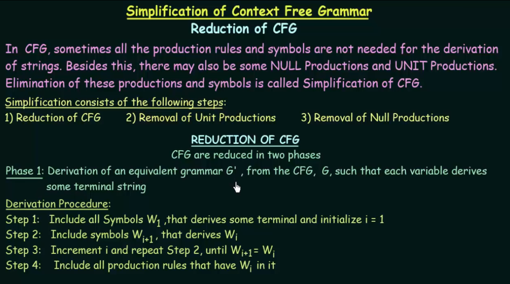

# Grammar
Grammar refers to a set of rules that define the structure of strings in a formal language.

### Chomsky Classification of Grammars

# 1. Regular Grammar
A regular grammar refers to a type of formal grammar that generates a regular language. They are the simplest class of formal languages in the Chomsky hierarchy, which categorizes formal languages based on their generative power.

 
### Production Rules:
- Regular grammars use production rules of the form A → α, where A is a non-terminal symbol, and α is a string of terminals and/or non-terminals.
- The right-hand side of each production rule can only have one of the following forms: A → aB, A → a, or A → ε, where "a" is a terminal symbol, "B" is a non-terminal symbol, and ε is the empty string.

# 2. Context Free Grammar
Context Free languages can be generated by context-free grammars and recognized by pushdown automata. 
CFL provide a higher level of expressive power compared to regular languages, making them more suitable for representing the hierarchical and nested structures found in programming languages and other complex systems. This increased expressiveness comes with a trade-off in terms of parsing complexity.

### Production Rules:
These are more flexible and expressive. They allow for rules of the form A → α, where A is a non-terminal symbol, and α is any combination of terminal and non-terminal symbols (including the possibility of just a single terminal or non-terminal symbol on the right-hand side). This flexibility allows CFGs to represent more complex languages than regular grammars.

### Derivation Tree

There are two types of derivation tree

A grammar is said to be ambiguous if there exists two or more tree(of the same type-left/right) to represent a string w.

### Simplification of CFG

# Chomsky Normal Form

https://www.youtube.com/watch?v=FNPSlnj3Vt0&list=PLBlnK6fEyqRgp46KUv4ZY69yXmpwKOIev&index=80