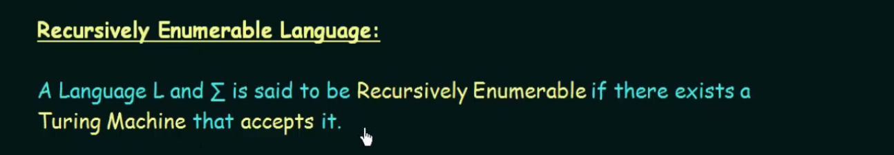
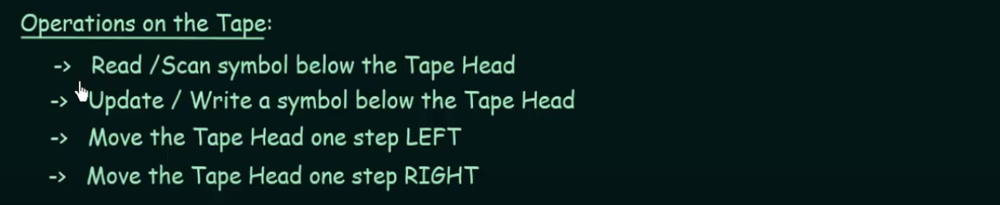
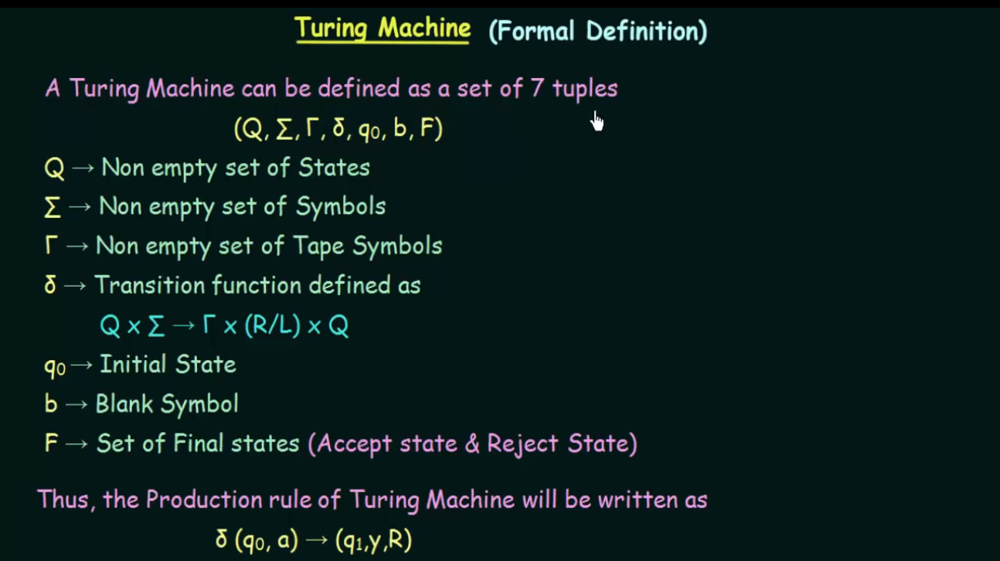
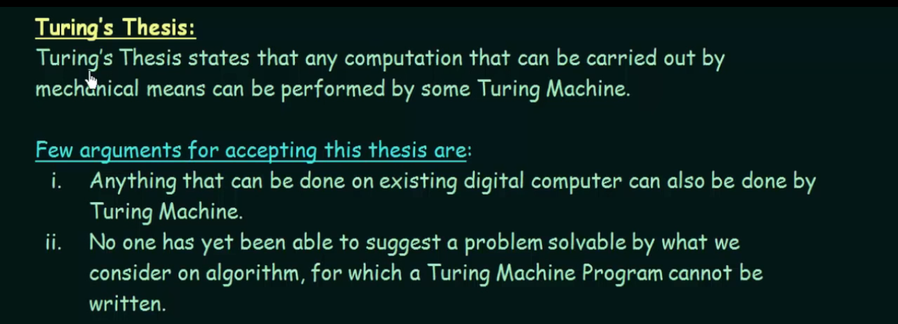

# RE language
It is produced by unrestrictive grammar, and is accepted by turing machine.

# Turing Machine

A Turing machine is a theoretical mathematical model of computation introduced by the mathematician and logician Alan Turing in 1936. It serves as a fundamental concept in the theory of computation and computability. The Turing machine consists of an infinite tape, a read/write head that moves along the tape, and a finite set of states.

A Turing machine is capable of simulating the logic of any algorithm, making it a powerful theoretical concept for understanding the limits and possibilities of computation. The Church-Turing thesis suggests that anything computable can be computed by a Turing machine, although this is a theoretical notion and not a practical one given the physical limitations of real-world computers.

https://www.youtube.com/watch?v=0D7yInuKvKs&list=PLBlnK6fEyqRgp46KUv4ZY69yXmpwKOIev&index=99

