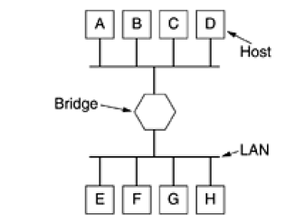
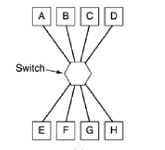
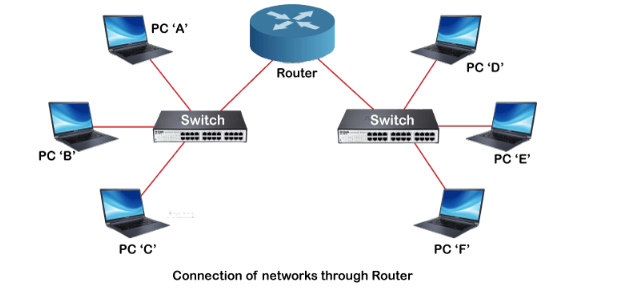

# 1. Repeater
- Operates in physical layer
- Extends reach of network by amplifying and retransmitting signal
- Simple device, no data modification
- May introduce delay in transmission
- Unable to manage traffics
- Being replaced now by more intelligent devices

# 2.Hubs
- Operate at physical layer
- Connects multiple devices in a network and allows them to communicate with each other.
- Serves as a central connection point for devices on a network, and facilitates communication by broadcasting data to all connected devices -> dumb
- Simple device - no security, ability to manage traffic, filtering
- Being replaced now by more intelligent devices like switches

# 3. Bridges

- Operate at the data link layer, uses MAC address for forwarding
- A network bridge is a device that connects and filters traffic between two or more network segments, making them function as a single network. 
- Manages collision, thus improving overall efficiency of the network
- Reduces unnecessary traffic, by providing data to required nodes only
- Adapts to changes in the network, ensuring efficient and accurate forwarding decisions.

# 4. Switches

-  They are essential components in local area networks (LANs) and are used to connect multiple devices within a network, enabling efficient communication.
- Operate in data link layer. So they donot know anything about the IP addresses(Layer 3 address) of its devices. IT knows about its MAC address though
- Unlike hubs or simple bridges, switches provide more intelligent and efficient handling of network traffic.
- They build and maintain a MAC address table that maps MAC addresses to specific switch ports
- Switches use the MAC address table to forward frames only to the port where the destination device is located- reduces traffic
- Supports 
    - collision domain separation
    - Broadcase handling
    - Full duplex communication
    - VLAN support
    - Larger data handling capability
    - Better scalability
- Switches have largely replaced older technologies like hubs and simple bridges in modern networks.
- They store the mac address in a table, and thus know exactly in which ports each devices are

# 5. Routers

- Operate in Network layer
- Routers connect different networks together and facilitate the exchange of data between them.
- They route data between different IP addresses
- Can do dynamic routing
- Supports 
  - Subnetting
  - Address translation
  - Firewall functionaliy
  - Packet filtering
  - WAN connectivity

# 6. Gateways
- operate at the application layer
- A gateway is a network device or software application that serves as an entry point or interface between two different networks, allowing them to communicate and share information. 
- Gateways can translate data between different communication protocols. 
- They have
  - Data Format Conversion
  - Security Features
  - Bi-directional Communication
  - Network Segmentation

# NIC - Network Interface Card
 - NIC is a network adapter that is used to connect the computer to the network.
 - It is installed in the computer to establish a LAN. 
 - It has a unique id(MAC address) that is written on the chip, and it has a connector to connect the cable to it. 
 - NIC card is a layer 2 device which means that it works on both the physical and data link layers of the network model. 

# Modem
- Modem stands for modulator and demodulator
- A device that brings internet to the home
- Converts the analog data signal from the ISP(Internet Service Provider) into digital signal, so that computer will be able to understand the data

# Basic Idea of how internet comes to your house
In a typical home network configuration, the modem and router work together to establish connectivity between the local network and the Internet Service Provider (ISP).

The modem serves as the gateway to the ISP, receiving incoming signals and converting them from analog to digital for the understanding of connected devices. Equipped with one or more (generally it is one) Ethernet ports, the modem establishes a wired connection either directly with a computer or with a router. 

The router, a crucial component in the local network, manages internal connections within the home. Connected devices link to the router either through wired Ethernet connections. The router assigns local IP addresses to these devices, facilitating communication within the local network, creating a LAN. Additionally, it serves as a gateway to the internet, allowing devices to access online resources. It generally also have a switch installed in it, allowing multiple devices to access internet though the ethernet ports. Recenlly, routers come with WAP(Wireless Access Point), allowing devices to connect to it using WiFi. Modern routers also come with firewall, for enhanced protection.

 Together, the modem and router form the backbone of a home network, providing the means for devices to communicate locally and connect to the broader internet.