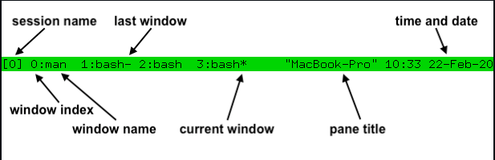

# TMUX - terminal multiplexer
tmux is a program which runs in a terminal and allows multiple other terminal programs to be run inside it. It allows multiple sessions with windows, panes, and more.

## Primary uses
- Protect running programs on a remote server from connection drops by running them inside tmux.
- Allow programs running on a remote server to be accessed from multiple different local computers.
- Work with multiple programs and shells together in one terminal, a bit like a window manager.

## TMUX concepts
- tmux keeps all its state in a single main process, called the tmux server.
- Panes are the individual sections within a window that can be split and used for different tasks.
- Windows are the separate environments within which these panes exist. A window is made up of one or more panes which together cover its entire area. 
- Sessions allow you to group related windows together and provide a convenient way to manage and switch between them. 

## Tmux status line

# Commands

1. tmux new: Creates a new tmux session.
2. tmux new -s SessionName: Creates a new session with the SessionName
3. :neww -dnmynewwindow: Creates a new window, if run in tmux command mode
4. 

# Shortcuts
1. C-b ?: Open help
2. C-b 0: Switches window to '0'th
3. C-b l: Switches to last window

# I'll read rest later
https://github.com/tmux/tmux/wiki/Getting-Started