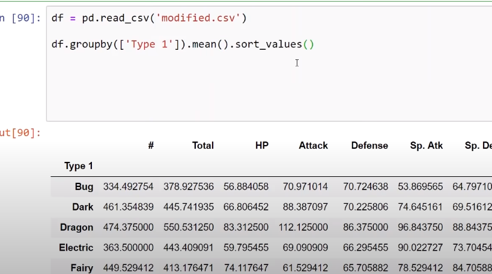
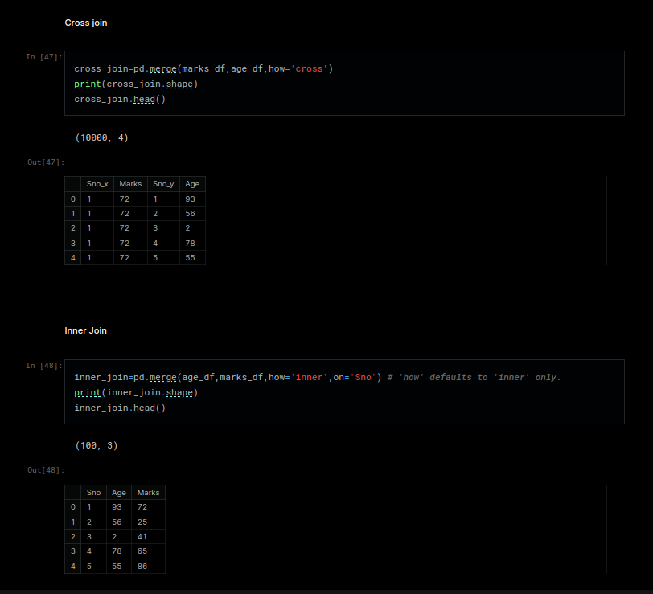
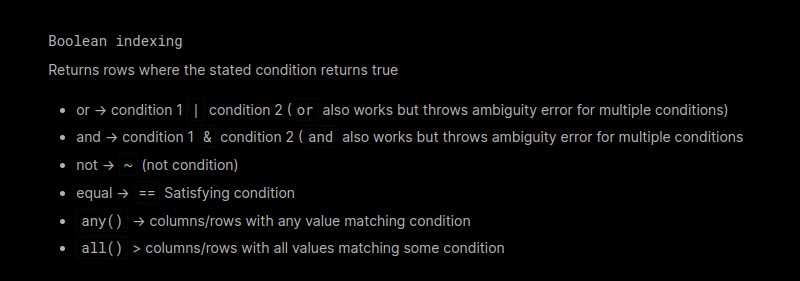

# PANDAS TUTORIAL

# Loading data
- pd.read_csv() # Reads a csv file as pandas Dataframe

# DataFrame basic information
- df.describe()
- df.info()
- df.head(5) # Read first 5 rows with all columns
- df.shape
- df.columns
- df['col1'].value_counts() # Count the occurence of each value of a column
- df.isnull().sum() # To get count of null for each column
- df.nunique() # unique value for each variable
- df.reset_index() 
- 
  
# Create DataFrame
- df = pd.DataFrame(np_array/dict/etc.)

# Accessing data from a DataFrame
- df[['col1_name','col2_name']] # Reads both columns from the DataFrame df
- df.iloc[0:4,0] # Reads the first five rows and first column
- df.loc[0,'col1_name'] # Same as iloc, but with as textual column names
- df.iterrows() # Creates a generator, which can be used to easily iterate through the columns

# Reading df as chunks
- for df in pd.read_csv('cow.txt', chunksize=100) # Read 100 rows at a time
      print(df)

# Saving df as a file 
- df.to_csv('name', index=False) # Save as csv

# Manipulating columns
- df['new_col'] = df['col1'] + df['col2'] # Create a new column
    - df['new_col'] = df.iloc[:,0: 10].sum(axis=1) # Create a new col, which is the sum of all the 10 columns
- df.drop(columns = ['new_col'])
- df.rename(columns={'Sex':'Gender','Name':'Full Name','last_name':'Surname','first_name':'Name'})

# Manipulating rows

### Basics
- df=df.drop(df.index[-1],axis=0) # Deletes last row
- 
# Sorting
- df.sort_values(['col1', 'col2'], ascending=[1,0]) # Sorts by col1 in ascending manner. If col1 for multiple rows are the same, it will sort those columns by col2 in descending manner.

### Conditionals
- df.loc[(df['name'] = 'Tom') & (df['age'] = '10')] # Select all rows with the conditions specified. Don't forget the stupid extra paranthesis
- df.loc[df['name] == 'cow', ['age', 'good']] = [100,True]# Set age to 100 and good to True if name is cow 

### Using groupby()
- df.groupby(['age']).mean() # Takes the mean for all columns for the rows with each discrete age value
  - min(), max()
  - mean(), median(), mode()
  - count()

### Using agg()
later bro.

### Using apply()
- df['last_name'] = df['Name'].apply(lambda x: x.split()[-1])
- df['last_name'] = df['Name'].apply(lambda x: custom_defined_function(x))

### Using map()
- df['col'] = df['col'].map({"male":'0',"female":"1"})

### Using fillna()
- df['col'].fillna(df['col'].mean(),inplace=True)

### Using regular Expressions
- df.loc[df['col1'].str.contains('cow|goat',regex = True)] # Uses re module and selects all rows where cow or goat is present

### Using query()
- df.query('Age > PassengerId')

### Using filter()
- df.filter(items=['Age', 'Sex'])[:2]
- df.filter(regex='ed$', axis=1)[:2] # regex

### Using isin()
- df[df.Pclass.isin([0,1])].head() # Filter rows of column based on list of multiple values

### Using duplicated()
- sum(df.PassengerId.duplicated())
- df.loc[:,['Sex', 'Embarked']].drop_duplicates(subset=['col1', 'col2'])
- duplicates_df = df[df.duplicated(keep=False)]

# Joining Tables

# Boolean Indexing
