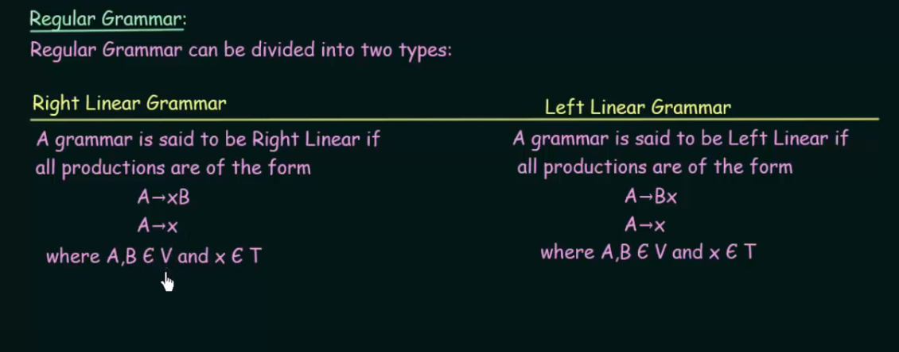

# 1. Regular Grammar
A regular grammar refers to a type of formal grammar that generates a regular language. They are the simplest class of formal languages in the Chomsky hierarchy, which categorizes formal languages based on their generative power. It is recogonised by finite state machines.

 
### Production Rules:
- Regular grammars use production rules of the form A → α, where A is a non-terminal symbol, and α is a string of terminals and/or non-terminals.
- The right-hand side of each production rule can only have one of the following forms: A → aB, A → a, or A → ε, where "a" is a terminal symbol, "B" is a non-terminal symbol, and ε is the empty string.

# Pumping lemma
Regular languages are languages that can be represented using finite state machines. Pumping lemma is used to prove if a language is NOT REGULAR.

