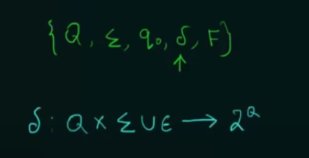

# Finite State Machine
A Finite State Machine (FSM), also known as a Finite Automaton, is a theoretical model of computation used to represent and control execution flow. It `consists of a finite number of states and transitions between those states`, usually triggered by input symbols. An FSM can be used to model various types of behavior, including digital circuits, parsing, and lexical analysis in compilers. `It is the simplest model of computation and has limited memory.`

#### Classification of FSMs

## Regular Language
A language is called a regular language if and only if a FSM recogonises it.
- Every RL will have a regular expression that can describe it
- There exists a reqular grammar that can generate it.
- Pumping lemma and closure properties are satisfied.

## Regular Grammar
A regular grammar is a type of formal grammar that generates a regular language. It is one of the simplest forms of grammars and is closely associated with regular languages, which can be recognized by finite automata. 

# DFA
A Deterministic Finite Automaton (DFA) is a specific type of Finite State Machine (FSM) that has a set of states, a set of transitions between these states, an initial state, and a set of accepting states. The key difference between a DFA and a general FSM is that in a DFA, for each combination of a current state and an input symbol, there is exactly one uniquely determined next state.

Another way to think: A machine is deterministic if it consistently gives the same output for a given input. This is generally a desirable quality. 

The transition funciton is defined as:

The equivalence of a Deterministic Finite Automaton (DFA) and a Regular Grammar means that for every regular language recognized by a DFA, there exists a corresponding regular grammar that generates the same language, and vice versa.

### Equivalence of DFAs

### Minimisation of DFA
Minimisation of DFA is done to make the DFA do the same task with the minimum number of states.
### 1. Minimisation using partitioning method

### 2. Minimisation using Myhill-Nerdoe Theorem - Table filling method

 

# NFA
A Non-deterministic Finite Automaton (NFA) is another type of Finite State Machine (FSM), similar to a Deterministic Finite Automaton (DFA), but with a key difference in the transition function. In an NFA, for a given state and input symbol, there `can be multiple possible transitions to different states or even no transition at all.`
- Every DFA is a NFA, but not vice versa.
- For every NFA, there is an equivalent DFA.

### Conversion of a NFA into a DFA
We can convert any NFA into a DFA.

# Epsilon NFA
An Epsilon-Nondeterministic Finite Automaton (ε-NFA or ENFA) is an extension of a Nondeterministic Finite Automaton (NFA) that includes the `ability to make "epsilon transitions"` (ε-transitions). 
It is defined as:

An epsilon transition allows the automaton to move from one state to another without consuming any input symbol. Every state on getting epsilon goes to itself also.

### Epsilon closure
Epsilon closure of a state refers to all the states that can be reached by from that state only seeing epsilon.

### Epsilon NFA to NFA

# Finite Automata with Outputs
They come in two types: 

