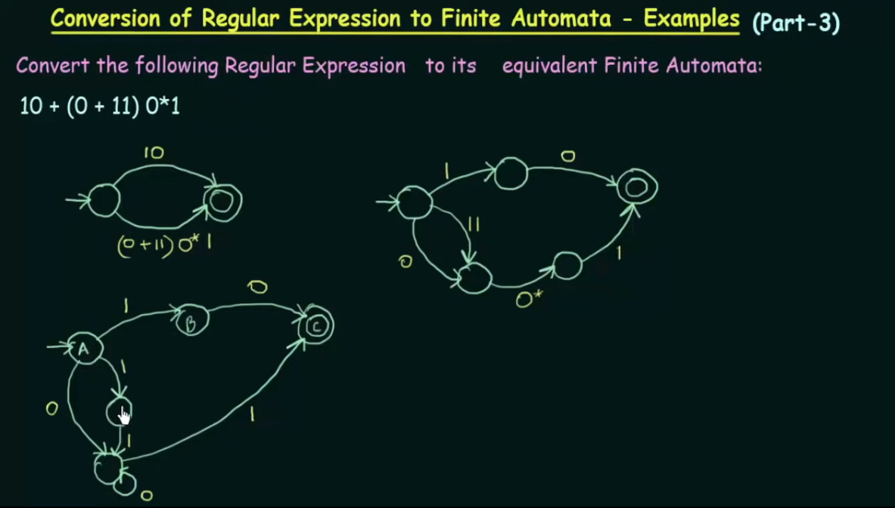

# Regular Expression
In Theory of Computation, regular expression is `a way of representing strings in algebraic manner`.

It can be also thought of as a `sequence of characters that defines a search pattern`, primarily for use in pattern matching with strings. The 're' library in python can be used to extract strings from text based on patterns.

It consists of:
   1. Literals: Ordinary characters that match themselves.
   2. Metacharacters: Characters with special meanings, such as ., *, ^, etc.  
   3. Escaped Characters: A backslash \ is used to escape metacharacters, allowing them to be used as literals.
   4. Quantifiers: Specify how many instances of a character or group are required.

# Arden's Theorem

https://www.youtube.com/watch?v=OKFrju0HB7k&list=PLBlnK6fEyqRgp46KUv4ZY69yXmpwKOIev&index=51

Using these, there are a lot of things to be done like converting DFA/NFA/ENFA to RE, and vice versa.

