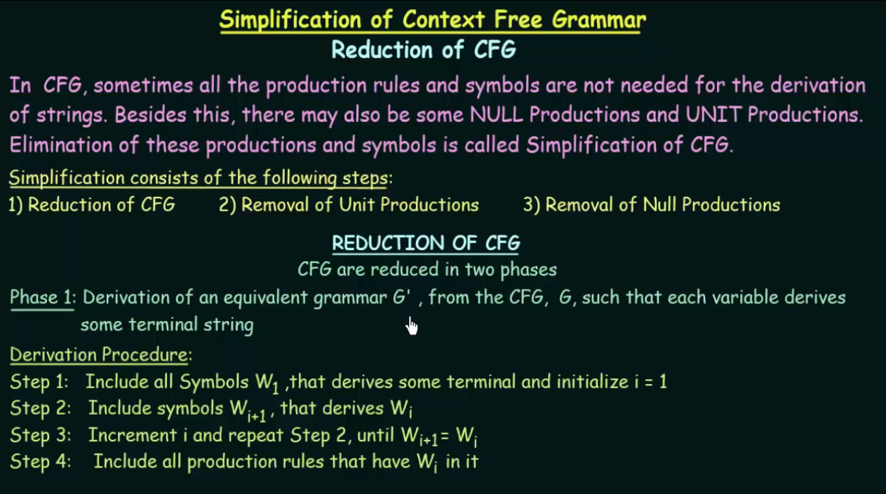

# 2. Context Free Grammar
Context Free languages can be generated by context-free grammars and recognized by pushdown automata. 

Context Free Language `provide a higher level of expressive power compared to regular languages, making them more suitable for representing the hierarchical and nested structures found in programming languages and other complex systems`. This increased expressiveness comes with a trade-off in terms of parsing complexity.

### Production Rules:
These are more flexible and expressive. They allow for rules of the form A → α, where A is a non-terminal symbol, and α is any combination of terminal and non-terminal symbols (including the possibility of just a single terminal or non-terminal symbol on the right-hand side). This flexibility allows CFGs to represent more complex languages than regular grammars.

### Derivation Tree

There are two types of derivation tree

A grammar is said to be ambiguous if there exists two or more tree(of the same type-left/right) to represent a string w.

### Simplification of CFG

# Chomsky Normal Form
Chomsky Normal Form (CNF) is a specific form used in the context of formal grammars, particularly in the study of context-free grammars (CFGs).

In CNF, production rules are simplified to have only two non-terminals on the right-hand side, and no rules with ε (epsilon, indicating an empty string) or unit productions (where a single non-terminal leads to another single non-terminal). This standardization simplifies various parsing algorithms and formal analyses in the field of formal languages and automata theory.

# Pumping lemma for CFL

