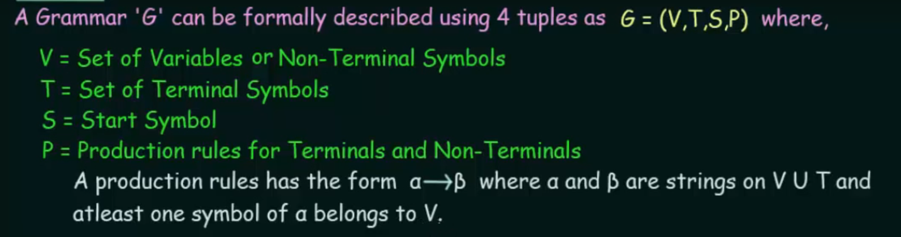

# Grammar
Grammar refers to a set of rules that define the structure of strings in a formal language.

### Chomsky Classification of Grammars

https://www.youtube.com/watch?v=FNPSlnj3Vt0&list=PLBlnK6fEyqRgp46KUv4ZY69yXmpwKOIev&index=80