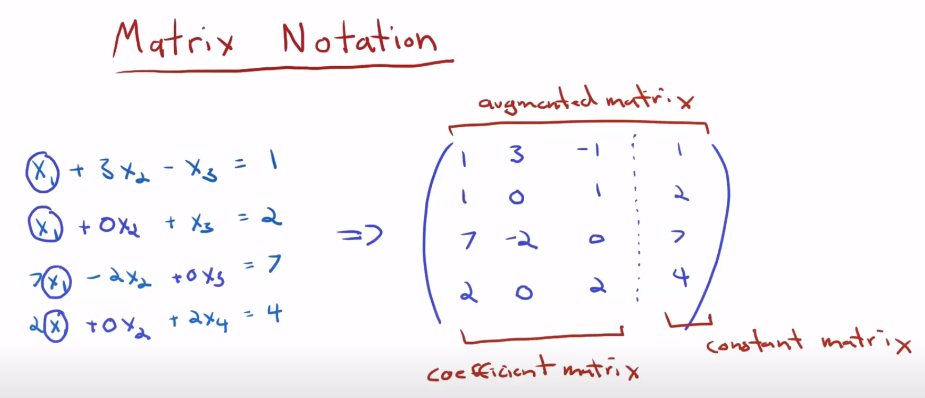
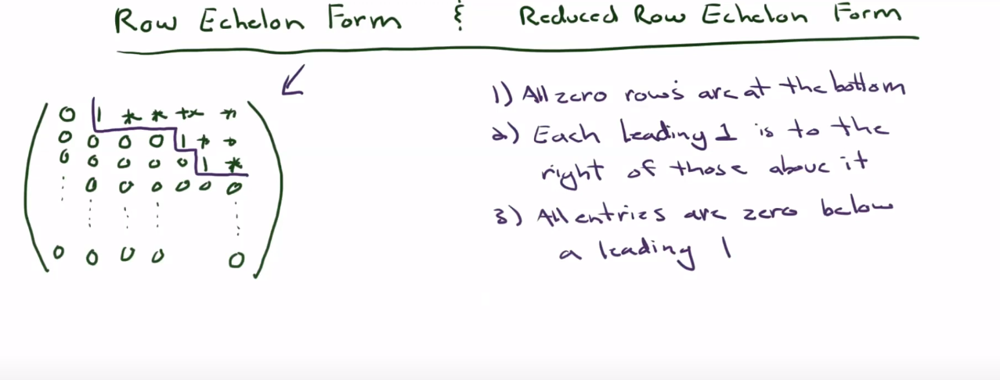

# Linear Algerba
Linear algebra is our 'good old algebra' that focuses on the study of vector spaces and linear mappings between those spaces. Algebraic representation of linear algebra problems will be linear equations. Geometrically, there will be no curves. 

## Vector Spaces
A vector space is a set of vectors that satisfies certain algebraic properties. These properties include closure under vector addition and scalar multiplication, associativity, commutativity, and the existence of additive and multiplicative identities.

# 1. Linear System of Equations

## Solution
Value of variable that satisfies multiple linear eqn is called the solution of the system of eqns. Geometrically, this solution will be on the intersection of the geometrical eqns(which can be lines, planes or hyperplanes).

## Matrix
A matrix is a two-dimensional array of numbers, symbols, or expressions, arranged in rows and columns. Matrix is vastly exploited by linear algebra to represent 
 - Systems of linear equations
 - Linear transformations
 - Eigenvalues and Eigenvectors, etc

## Representation in Matrix form
Matrix can be used to reperesent a system of liner equations as:

System of linear eqns can be solved by using matrix using A@X = B, where @ refers to matmul.
While doing all this, we can do three operations which will not change the solution set
 - Multiply a row with a scalar
 - Add/sub a row with the multiple of another row
 - Interchange rows

## Row echlon form
Row echlon form of a matrix is a minimised version of the matrix that retains the same sollutions as the base matrix. Converting to this form can be helpful when doing matmul manully. There can be multiple row echlon form of a single matrix.

# 3. Vectors
A vector is a mathematical object used to represent quantities that have both magnitude and direction. 
There are (at least) three different ways to think about vectors: a vector as an array of numbers (a computer science view), a vector as an arrow with a direction and magnitude (a physics view), and a vector as an object that obeys addition and scaling (a mathematical view).

## Representation of vectors
 - In linear algebra, column vector form is often used when defining vectors, especially when working with matrix-vector multiplication because it aligns well with the matrix structure.
 - In physics, it's common to use row vector form for quantities like position vectors, which makes it easier to perform dot products with other vectors.
 - In computer programming, the choice may depend on the programming language and libraries being used.
 
## Properties
 - Scalar multiplication
 - Vector Addition