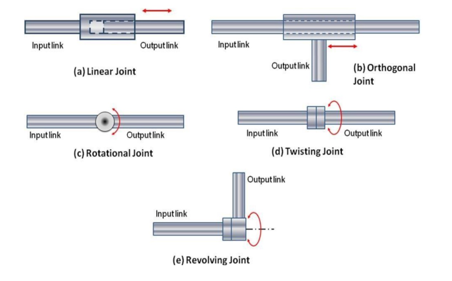

# Robot
- a re-programmable, multi-functional manipulator
- intelligent agent, physical or virtual, capable of doing a task autonomously or with guidance
- an automatic device that performs functions ordinarily ascribed to human beings

### Requirements
- perception
- ablility to complete different tasks
- re-programmable
- functions autonomously

# Components of a robot
1. Control System:
- Microcontroller: A small computer that controls the robot's actions.
- Programmable Logic Controller (PLC): A type of microcontroller used in industrial robots.
- Central Processing Unit (CPU): The brain of the robot that executes instructions.
  
2. Sensors:
- Visual Sensors: Cameras, lidars, and other sensors that provide visual feedback.
- Ultrasonic Sensors: Measure distance and detect obstacles.
- Infrared Sensors: Detect heat and temperature changes.
- Touch Sensors: Detect touch and pressure.
- Acoustic Sensors: Detect sound and vibrations.
- GPS Sensors: Provide location and navigation data.

3. Actuators:
- Motors: Electric motors that provide movement and power.
- Servo Motors: Precise motors used for positioning and movement.
- Stepper Motors: Used for precise positioning and movement.
- Pneumatic Actuators: Use compressed air to provide movement and power.
- Hydraulic Actuators: Use fluid pressure to provide movement and power.

4. Power Supply:
- Battery: Provides power to the robot.
- Power Converter: Converts AC to DC power.
- Charger: Charges the battery.

5. Communication:
- Wireless Communication: Wi-Fi, Bluetooth, or other wireless protocols.
- Ethernet: Wired communication protocol.
- Serial Communication: Serial communication protocols like RS-232 or RS-485.

6. Safety Features:
- Safety Sensors: Detect obstacles and prevent accidents.
- Emergency Stop: A button that stops the robot in case of an emergency.
- Safety Interlocks: Prevent the robot from moving or operating when not in use.

7. Mechanical Components:
- Frames: The structural framework of the robot.
- Joints: Allow for movement and flexibility.
- Linkages: Connect mechanical components and allow for movement.
- Grippers: Used for grasping and manipulating objects.
- End Effectors: Attachments that perform specific tasks, such as welding or cutting.

8. Software:
- Operating System: Manages the robot's software and hardware.
- Programming Languages: Used to write code for the robot.
- Robot Operating System (ROS): An open-source software framework for robotics.

# Degrees of Freedom
- number of independent parameters that define its configuration of the robot
- To define a rigid body in space, we need 6 doF: 3 components of translation, 3 components of rotation

# Robot Anatomy
- Joints
- Links
- End effector
  - Grippers
  - Tools
- Actuators - drivers that move the joints in robots
- Sensors - senses the environment
- Controller

# Joints

# Robotic Arm Configuration
.png>)

# Dynamic Characteristics of Robots
1. Speed of Motion
2. Load Carrying Capacity
3. Speed of Response

# Isaacc Asimov’s 3 laws of Robotics
1. A robot may not injure a human being or, through inaction, allow a human being to come to harm.
2. A robot must obey orders given it by human beings except where such orders would conflict with the First Law.
3. A robot must protect its own existence as long as such protection does not conflict with the First or Second Law.